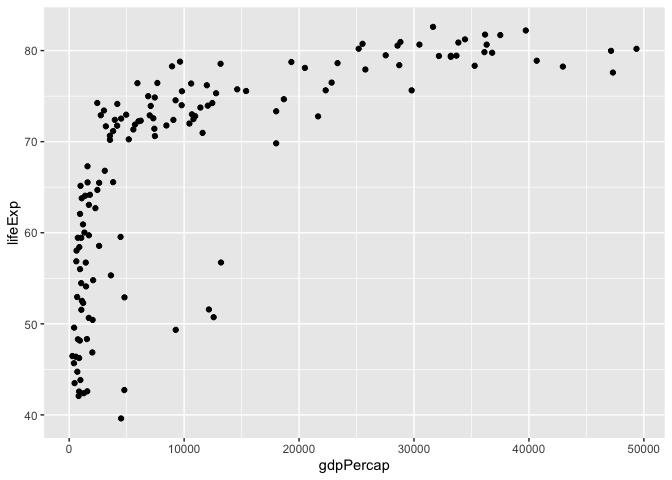
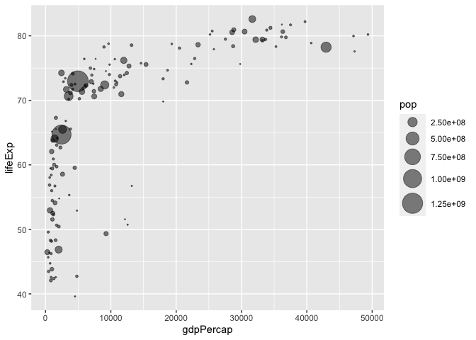

Class 5: Data Visualization
================
Andres Sandoval

# Plotting in R

R has multiple plotting and graphics systems. The most popular of which
is **ggplot2**.

We have already played with “base” R graphics. This comes along with R
“out of the box”.

``` r
plot(cars)
```


Compared to base R plots, ggplot is much more verbose - I need to write
more code to get simple plots like the above.

To use ggplot I need to first install the ggplot2 package. To install
any package in R, use the `install.packages()` command along with the
package name.

The install is a one time only requirement. The package is now on our
computer. I don’t need to re-install it.

However, I can’t just use it without loading it up with a `library()`
call.

``` r
#install.packages("ggplot2")
library(ggplot2)
```

``` r
ggplot(cars)
```


All ggplot figures need at least three things:

- data (this is the data.frame with our numbers) -aesthetics (“aes”, how
  our data maps to the plot) -geometrys (“geoms\_”, do want lines,
  points columns, etc)

``` r
bb <- ggplot(data=cars) + 
  aes(x = speed, y = dist) + 
  geom_point()
```

``` r
bb
```


I want a trend line to show the relationship between speed and stopping
distance

``` r
ggplot(data=cars) + 
  aes(x = speed, y = dist) + 
  geom_point() +
  geom_line()
```


That is not what we want

``` r
ggplot(data=cars) + 
  aes(x = speed, y = dist) + 
  geom_point() +
  geom_smooth()
```

    `geom_smooth()` using method = 'loess' and formula = 'y ~ x'


## Gene

``` r
url <- "https://bioboot.github.io/bimm143_S20/class-material/up_down_expression.txt"
genes <- read.delim(url)
```

head(dataset) function will print out teh first 6 rows of the data set

``` r
head(genes)
```

            Gene Condition1 Condition2      State
    1      A4GNT -3.6808610 -3.4401355 unchanging
    2       AAAS  4.5479580  4.3864126 unchanging
    3      AASDH  3.7190695  3.4787276 unchanging
    4       AATF  5.0784720  5.0151916 unchanging
    5       AATK  0.4711421  0.5598642 unchanging
    6 AB015752.4 -3.6808610 -3.5921390 unchanging

Total genes

``` r
nrow(genes)
```

    [1] 5196

Column Names and Number of columns

``` r
colnames(genes)
```

    [1] "Gene"       "Condition1" "Condition2" "State"     

``` r
ncol(genes)
```

    [1] 4

Number of Upregulated Genes

``` r
table(genes[,"State"])
```


          down unchanging         up 
            72       4997        127 

Fraction of total genes

``` r
round( table(genes$State)/nrow(genes) * 100, 2 )
```


          down unchanging         up 
          1.39      96.17       2.44 

Saved the plot as p

``` r
p <- ggplot(genes) + 
  aes(Condition1,Condition2, color = State) +
  geom_point() +
  labs(title = "Gene Plot")
```

``` r
p
```


Change the colors of p

``` r
p + scale_colour_manual( values=c("blue","gray","red") )
```


Add Plot Annotations

``` r
p + scale_colour_manual(values=c("blue","gray","red")) +
    labs(title="Gene Expresion Changes Upon Drug Treatment",
         x="Control (no drug) ",
         y="Drug Treatment")
```


# Gapminder 2007

``` r
#install.packages("gapminder")
#install.packages("dplyr")
library(gapminder)
library(dplyr)
```


    Attaching package: 'dplyr'

    The following objects are masked from 'package:stats':

        filter, lag

    The following objects are masked from 'package:base':

        intersect, setdiff, setequal, union

``` r
gapminder_2007 <- gapminder %>% filter(year==2007)
```

``` r
head(gapminder_2007)
```

    # A tibble: 6 × 6
      country     continent  year lifeExp      pop gdpPercap
      <fct>       <fct>     <int>   <dbl>    <int>     <dbl>
    1 Afghanistan Asia       2007    43.8 31889923      975.
    2 Albania     Europe     2007    76.4  3600523     5937.
    3 Algeria     Africa     2007    72.3 33333216     6223.
    4 Angola      Africa     2007    42.7 12420476     4797.
    5 Argentina   Americas   2007    75.3 40301927    12779.
    6 Australia   Oceania    2007    81.2 20434176    34435.

``` r
ggplot(gapminder_2007) +
  aes(x=gdpPercap, y=lifeExp) +
  geom_point()
```



Changing the transparency

``` r
ggplot(gapminder_2007) +
  aes(x=gdpPercap, y=lifeExp) +
  geom_point(alpha=0.5)
```


Adding more variables to aes

``` r
ggplot(gapminder_2007) +
  aes(x=gdpPercap, y=lifeExp, color=continent, size=pop) +
  geom_point(alpha=0.5)
```


Numeric Pop Points

``` r
ggplot(gapminder_2007) + 
  aes(x = gdpPercap, y = lifeExp, color = pop) +
  geom_point(alpha=0.8)
```


Adjusting Point Size

``` r
ggplot(gapminder_2007) + 
  aes(x = gdpPercap, y = lifeExp, size = pop) +
  geom_point(alpha=0.5)
```


Scaling

``` r
ggplot(gapminder_2007) + 
  geom_point(aes(x = gdpPercap, y = lifeExp,
                 size = pop), alpha=0.5) + 
  scale_size_area(max_size = 10)
```



Gapminder 1957

``` r
gapminder_1957 <- gapminder %>% filter(year==1957)

ggplot(gapminder_1957) + 
  aes(x = gdpPercap, y = lifeExp, color=continent,
                 size = pop) +
  geom_point(alpha=0.7) + 
  scale_size_area(max_size = 10)
```


Gapminder 1957 and 2007

``` r
gapminder_1957 <- gapminder %>% filter(year==1957 | year==2007)

ggplot(gapminder_1957) + 
  geom_point(aes(x = gdpPercap, y = lifeExp, color=continent,
                 size = pop), alpha=0.7) + 
  scale_size_area(max_size = 10) +
  facet_wrap(~year)
```


Final Graph

``` r
gapminder_1957 <- gapminder %>% filter(year==1957 | year==2007)

ggplot(gapminder_1957) + 
  geom_point(aes(x = gdpPercap, y = lifeExp, color=continent,
                 size = pop), alpha=0.7) + 
  scale_size_area(max_size = 10) +
  facet_wrap(~year) +labs(title = "Life Expectancy")
```


