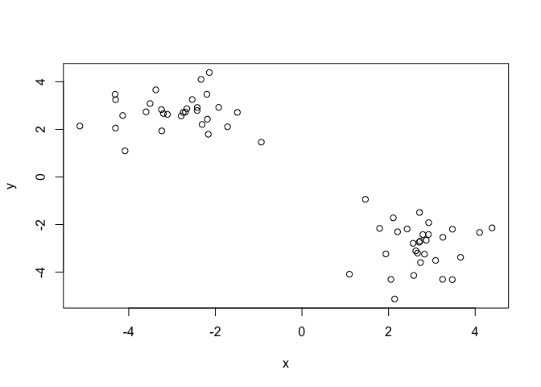
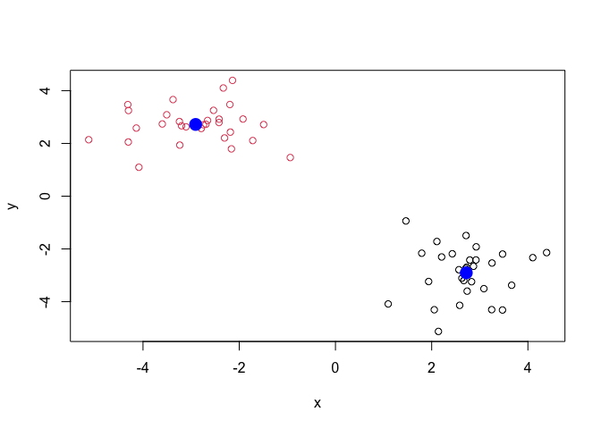
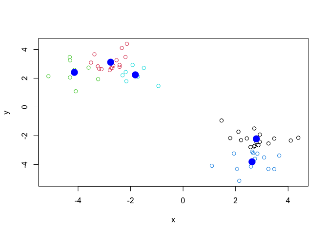
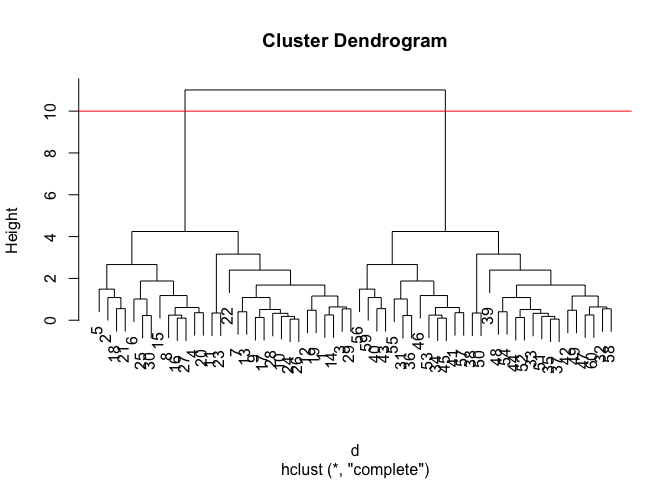
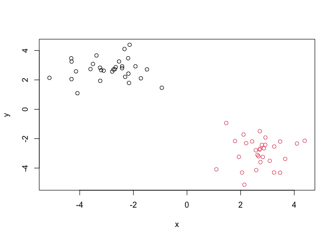
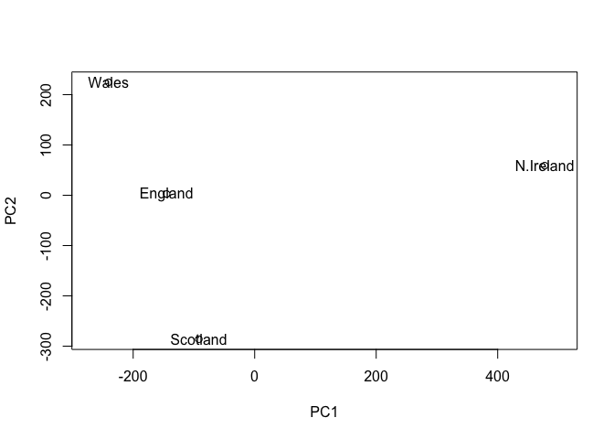
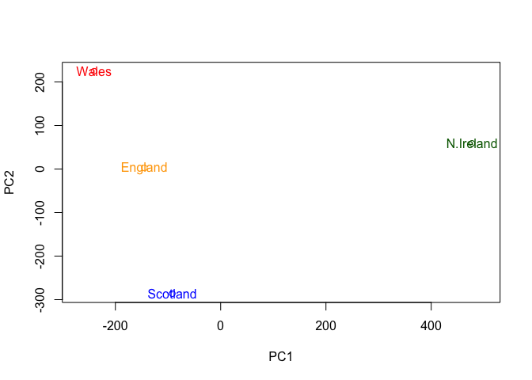

Class 7: Machine Learning 1
================

In this class we will explore clustering and dimensionality reduction
methods.

## K-means

Make up some input data where we know what the answer should be.

``` r
tmp <- c(rnorm(30, -3), rnorm(30, +3))
x <- cbind(x=tmp, y=rev(tmp))
head(x)
```

                 x        y
    [1,] -2.184287 2.428297
    [2,] -5.128308 2.139900
    [3,] -2.162569 1.793041
    [4,] -3.506652 3.085293
    [5,] -4.085380 1.096073
    [6,] -3.376048 3.661926

Quick plot of x to see the two groups at (-3,3) and (3,-3)

``` r
plot(x)
```



Use the `kmeans()` function setting k to 2 and nstart=20

*the k value is how many centers/clusters there will be*

``` r
km <- kmeans(x, centers=2, nstart=20)
km
```

    K-means clustering with 2 clusters of sizes 30, 30

    Cluster means:
              x         y
    1  2.719151 -2.906200
    2 -2.906200  2.719151

    Clustering vector:
     [1] 2 2 2 2 2 2 2 2 2 2 2 2 2 2 2 2 2 2 2 2 2 2 2 2 2 2 2 2 2 2 1 1 1 1 1 1 1 1
    [39] 1 1 1 1 1 1 1 1 1 1 1 1 1 1 1 1 1 1 1 1 1 1

    Within cluster sum of squares by cluster:
    [1] 41.79635 41.79635
     (between_SS / total_SS =  91.9 %)

    Available components:

    [1] "cluster"      "centers"      "totss"        "withinss"     "tot.withinss"
    [6] "betweenss"    "size"         "iter"         "ifault"      

> Q. How many points are in each cluster

``` r
km$size
```

    [1] 30 30

> Q. What ‘component’ of your result details - cluster
> assignment/membership? - cluster center

``` r
km$cluster
```

     [1] 2 2 2 2 2 2 2 2 2 2 2 2 2 2 2 2 2 2 2 2 2 2 2 2 2 2 2 2 2 2 1 1 1 1 1 1 1 1
    [39] 1 1 1 1 1 1 1 1 1 1 1 1 1 1 1 1 1 1 1 1 1 1

``` r
km$centers
```

              x         y
    1  2.719151 -2.906200
    2 -2.906200  2.719151

> Q. Plot x colored by the kmeans cluster assignment and add cluster
> centeres as blue points *(should use the km cluster membership to do
> so)*

``` r
plot(x, col= km$cluster)
#km$Ccluster will color the clusters individually
points(km$centers, col="blue", pch=16, cex=2)
```



``` r
#points function will color whichever points you select separately
```

Play with kmeans to see differing number of clusters.

``` r
km <- kmeans(x, centers=5, nstart=20)
plot(x, col= km$cluster)
points(km$centers, col="blue", pch=16, cex=2)
```



\#Hierarchial Clustering

This is another very useful and widely employed clustering method which
has the advantage over kmeans in that it can help reveal the something
of the true grouping in your data.

The `hclust()` function wants a distance matrix as an input. *(A
distance matrix is a measure of similarity between two points.)*

``` r
d <- dist(x)
hc <- hclust(d)
hc
```


    Call:
    hclust(d = d)

    Cluster method   : complete 
    Distance         : euclidean 
    Number of objects: 60 

There is a plot method for hclust results:

``` r
plot(hc)
abline(h=10, col="red")
```



To get my cluster membership vector, I need to “cut” my tree to yield
sub-trees or branches with all the members of a given cluster residing
on the same cut branch. The function to do this is called `cutree()`

``` r
grps<- cutree(hc, h=10)
grps
```

     [1] 1 1 1 1 1 1 1 1 1 1 1 1 1 1 1 1 1 1 1 1 1 1 1 1 1 1 1 1 1 1 2 2 2 2 2 2 2 2
    [39] 2 2 2 2 2 2 2 2 2 2 2 2 2 2 2 2 2 2 2 2 2 2

``` r
#this is a membership vector
```

``` r
plot(x, col=grps)
```



Use k value instead of height (h). This will cut the tree to yield the
number of clusters you want.

``` r
cutree(hc, k=4)
```

     [1] 1 2 1 2 2 2 1 2 1 1 1 1 1 1 2 2 1 2 1 2 2 1 1 1 2 1 2 1 1 2 3 4 4 3 4 3 4 4
    [39] 4 3 3 4 3 4 3 3 4 4 4 4 4 4 3 4 3 3 3 4 3 4

# Principal Component Analysis (PCA)

The base R function for PCA is called `prcomp()`

*Data Import of UK Foods*

``` r
url <- "https://tinyurl.com/UK-foods"
x <- read.csv(url)
```

> Q1. How many rows and columns are in your new data frame named x? What
> R functions could you use to answer this questions?

``` r
# Shows the number of rows and columns respectively
dim(x)
```

    [1] 17  5

``` r
#or use nrow() and ncol() for rows and columns separately
nrow(x)
```

    [1] 17

``` r
ncol(x)
```

    [1] 5

It says that there are 17 rows and 5 columns in this data frame.

**Check the Data**

``` r
head(x)
```

                   X England Wales Scotland N.Ireland
    1         Cheese     105   103      103        66
    2  Carcass_meat      245   227      242       267
    3    Other_meat      685   803      750       586
    4           Fish     147   160      122        93
    5 Fats_and_oils      193   235      184       209
    6         Sugars     156   175      147       139

The data frame needs to be fixed as x is included in the total number of
columns. There are only 4 columns not 5, which was specified by the
`dim()` function.

``` r
#this code will remove the the first column from being counted as a column. 
rownames(x) <- x[,1]
x <- x[,-1]
head(x)
```

                   England Wales Scotland N.Ireland
    Cheese             105   103      103        66
    Carcass_meat       245   227      242       267
    Other_meat         685   803      750       586
    Fish               147   160      122        93
    Fats_and_oils      193   235      184       209
    Sugars             156   175      147       139

``` r
dim(x)
```

    [1] 17  4

This code works initially, but isn’t the best code to use. Instead use
this code.

``` r
x <- read.csv(url, row.names=1)
head(x)
```

                   England Wales Scotland N.Ireland
    Cheese             105   103      103        66
    Carcass_meat       245   227      242       267
    Other_meat         685   803      750       586
    Fish               147   160      122        93
    Fats_and_oils      193   235      184       209
    Sugars             156   175      147       139

``` r
dim(x)
```

    [1] 17  4

This line of code is better as it maintains the 4 columns.

> Q2. Which approach to solving the ‘row-names problem’ mentioned above
> do you prefer and why? Is one approach more robust than another under
> certain circumstances?

The `read.csv(url, row.names=1)` is the better approach. This is because
it maintains the four columns continuously. The
`rownames(x) <- x[,1] and then x <- x[,-1]` is not a good approach as it
continuously deletes the first column if the program is run more than
one time.

``` r
barplot(as.matrix(x), beside=T, col=rainbow(nrow(x)))
```


``` r
barplot(as.matrix(x), beside=F, col=rainbow(nrow(x)))
```


> Q3: Changing what optional argument in the above barplot() function
> results in the following plot?

Changing the `beside` argument to be False results in the categories to
be stacked rather than next to one another.

> Q5: Generating all pairwise plots may help somewhat. Can you make
> sense of the following code and resulting figure? What does it mean if
> a given point lies on the diagonal for a given plot?

``` r
pairs(x, col=rainbow(10), pch=16)
```


The following figure compares two countries at a time for each
individual plot. If a given point lies on a diagonal line, it most
likely represent that those two countries have similar food consumption.

> Q6. What is the main differences between N. Ireland and the other
> countries of the UK in terms of this data-set?

The main difference between N. Ireland and the other countries in the UK
is the blue dot that is almost like an outlier within most of the
diagonal lines. We were able to deduce from the statistics that the main
difference was fresh potato consumption. Without a legend it was
difficult to figure out. With this, we would need PCA in order to
determine what the blue dot is.

\#PCA to the Rescue

``` r
# Use the prcomp() PCA function 
pca <- prcomp( t(x) )
summary(pca)
```

    Importance of components:
                                PC1      PC2      PC3       PC4
    Standard deviation     324.1502 212.7478 73.87622 4.189e-14
    Proportion of Variance   0.6744   0.2905  0.03503 0.000e+00
    Cumulative Proportion    0.6744   0.9650  1.00000 1.000e+00

A “PCA Plot” (a.k.a “Score plot,” is PC1vsPC2 plot, etx)

> Q7. Complete the code below to generate a plot of PC1 vs PC2. The
> second line adds text labels over the data points.

``` r
# Plot PC1 vs PC2
plot(pca$x[,1], pca$x[,2], xlab="PC1", ylab="PC2", xlim=c(-270,500))
text(pca$x[,1], pca$x[,2], colnames(x))
```



> Q8. Customize your plot so that the colors of the country names match
> the colors in our UK and Ireland map and table at start of this
> document.

``` r
plot(pca$x[,1], pca$x[,2], xlab="PC1", ylab="PC2", xlim=c(-270,500),col=c("orange", "red", "blue", "darkgreen") )
text(pca$x[,1], pca$x[,2], colnames(x), col=c("orange", "red", "blue", "darkgreen") )
```



How much variation in the original data each PC accounts for

``` r
v <- round( pca$sdev^2/sum(pca$sdev^2) * 100 )
v
```

    [1] 67 29  4  0

or use..

``` r
z <- summary(pca)
z$importance
```

                                 PC1       PC2      PC3          PC4
    Standard deviation     324.15019 212.74780 73.87622 4.188568e-14
    Proportion of Variance   0.67444   0.29052  0.03503 0.000000e+00
    Cumulative Proportion    0.67444   0.96497  1.00000 1.000000e+00

``` r
## Lets focus on PC1 as it accounts for > 90% of variance 
par(mar=c(10, 3, 0.35, 0))
barplot( pca$rotation[,1], las=2 )
```


> Q9: Generate a similar ‘loadings plot’ for PC2. What two food groups
> feature prominantely and what does PC2 maninly tell us about?
