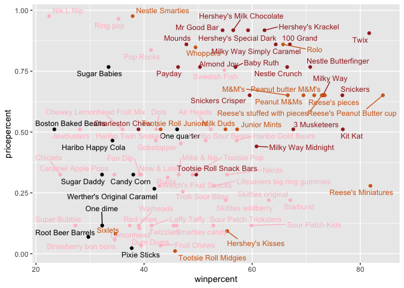
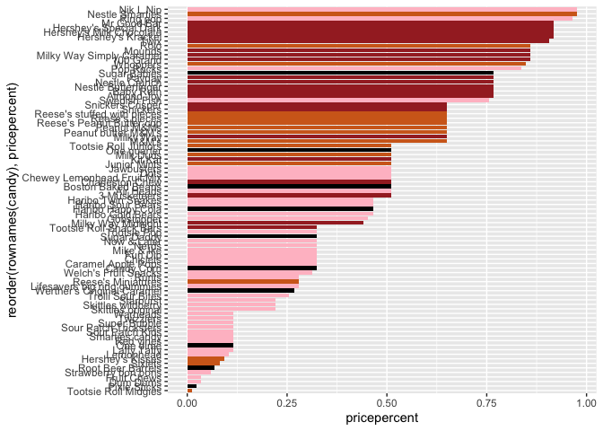
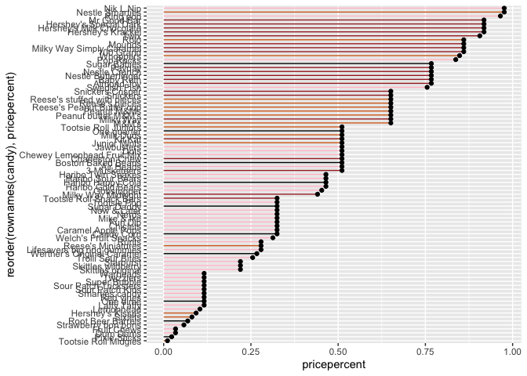
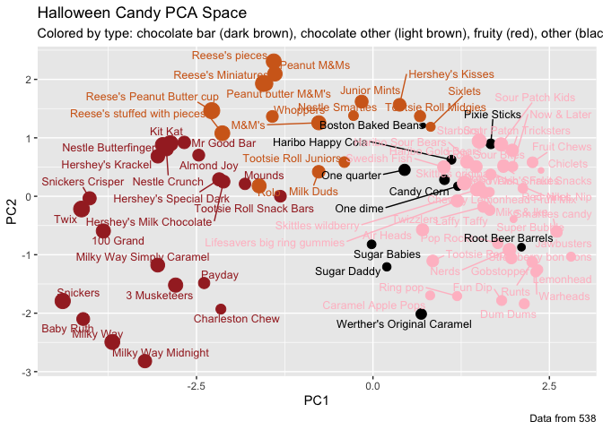

Class 10: Mini Project
================
Andres Sandoval

## Importing Candy Data

``` r
candy_file <- "candy-data.txt"
candy = read.csv(candy_file, row.names = 1)
head(candy)
```

                 chocolate fruity caramel peanutyalmondy nougat crispedricewafer
    100 Grand            1      0       1              0      0                1
    3 Musketeers         1      0       0              0      1                0
    One dime             0      0       0              0      0                0
    One quarter          0      0       0              0      0                0
    Air Heads            0      1       0              0      0                0
    Almond Joy           1      0       0              1      0                0
                 hard bar pluribus sugarpercent pricepercent winpercent
    100 Grand       0   1        0        0.732        0.860   66.97173
    3 Musketeers    0   1        0        0.604        0.511   67.60294
    One dime        0   0        0        0.011        0.116   32.26109
    One quarter     0   0        0        0.011        0.511   46.11650
    Air Heads       0   0        0        0.906        0.511   52.34146
    Almond Joy      0   1        0        0.465        0.767   50.34755

> Q1. How many different candy types are in this dataset?

``` r
dim(candy)
```

    [1] 85 12

``` r
nrow(candy)
```

    [1] 85

There are 85 different candy types in this dataset.

> Q2. How many fruity candy types are in the dataset?

``` r
sum(candy[,"fruity"])
```

    [1] 38

``` r
table(candy$fruity)
```


     0  1 
    47 38 

There are 38 fruity candy types in the data set.

## What is your favorite candy

``` r
candy["Twix", ]$winpercent
```

    [1] 81.64291

> Q3. What is your favorite candy in the dataset and what is it’s
> winpercent value?

``` r
#first view all the names of candies
row.names(candy)
```

     [1] "100 Grand"                   "3 Musketeers"               
     [3] "One dime"                    "One quarter"                
     [5] "Air Heads"                   "Almond Joy"                 
     [7] "Baby Ruth"                   "Boston Baked Beans"         
     [9] "Candy Corn"                  "Caramel Apple Pops"         
    [11] "Charleston Chew"             "Chewey Lemonhead Fruit Mix" 
    [13] "Chiclets"                    "Dots"                       
    [15] "Dum Dums"                    "Fruit Chews"                
    [17] "Fun Dip"                     "Gobstopper"                 
    [19] "Haribo Gold Bears"           "Haribo Happy Cola"          
    [21] "Haribo Sour Bears"           "Haribo Twin Snakes"         
    [23] "Hershey's Kisses"            "Hershey's Krackel"          
    [25] "Hershey's Milk Chocolate"    "Hershey's Special Dark"     
    [27] "Jawbusters"                  "Junior Mints"               
    [29] "Kit Kat"                     "Laffy Taffy"                
    [31] "Lemonhead"                   "Lifesavers big ring gummies"
    [33] "Peanut butter M&M's"         "M&M's"                      
    [35] "Mike & Ike"                  "Milk Duds"                  
    [37] "Milky Way"                   "Milky Way Midnight"         
    [39] "Milky Way Simply Caramel"    "Mounds"                     
    [41] "Mr Good Bar"                 "Nerds"                      
    [43] "Nestle Butterfinger"         "Nestle Crunch"              
    [45] "Nik L Nip"                   "Now & Later"                
    [47] "Payday"                      "Peanut M&Ms"                
    [49] "Pixie Sticks"                "Pop Rocks"                  
    [51] "Red vines"                   "Reese's Miniatures"         
    [53] "Reese's Peanut Butter cup"   "Reese's pieces"             
    [55] "Reese's stuffed with pieces" "Ring pop"                   
    [57] "Rolo"                        "Root Beer Barrels"          
    [59] "Runts"                       "Sixlets"                    
    [61] "Skittles original"           "Skittles wildberry"         
    [63] "Nestle Smarties"             "Smarties candy"             
    [65] "Snickers"                    "Snickers Crisper"           
    [67] "Sour Patch Kids"             "Sour Patch Tricksters"      
    [69] "Starburst"                   "Strawberry bon bons"        
    [71] "Sugar Babies"                "Sugar Daddy"                
    [73] "Super Bubble"                "Swedish Fish"               
    [75] "Tootsie Pop"                 "Tootsie Roll Juniors"       
    [77] "Tootsie Roll Midgies"        "Tootsie Roll Snack Bars"    
    [79] "Trolli Sour Bites"           "Twix"                       
    [81] "Twizzlers"                   "Warheads"                   
    [83] "Welch's Fruit Snacks"        "Werther's Original Caramel" 
    [85] "Whoppers"                   

``` r
#view favorite candy and its win percent
round(candy["Skittles original",]$winpercent, 2)
```

    [1] 63.09

Skittles original has a win percent of 63.09%

> Q4. What is the winpercent value for “Kit Kat”?

``` r
round(candy["Kit Kat",]$winpercent, 2)
```

    [1] 76.77

> Q5. What is the winpercent value for “Tootsie Roll Snack Bars”?

``` r
round(candy["Tootsie Roll Snack Bars",]$winpercent, 2)
```

    [1] 49.65

> Q6. Is there any variable/column that looks to be on a different scale
> to the majority of the other columns in the dataset?

``` r
library(skimr)
skim(candy)
```

|                                                  |       |
|:-------------------------------------------------|:------|
| Name                                             | candy |
| Number of rows                                   | 85    |
| Number of columns                                | 12    |
| \_\_\_\_\_\_\_\_\_\_\_\_\_\_\_\_\_\_\_\_\_\_\_   |       |
| Column type frequency:                           |       |
| numeric                                          | 12    |
| \_\_\_\_\_\_\_\_\_\_\_\_\_\_\_\_\_\_\_\_\_\_\_\_ |       |
| Group variables                                  | None  |

Data summary

**Variable type: numeric**

| skim_variable    | n_missing | complete_rate |  mean |    sd |    p0 |   p25 |   p50 |   p75 |  p100 | hist  |
|:-----------------|----------:|--------------:|------:|------:|------:|------:|------:|------:|------:|:------|
| chocolate        |         0 |             1 |  0.44 |  0.50 |  0.00 |  0.00 |  0.00 |  1.00 |  1.00 | ▇▁▁▁▆ |
| fruity           |         0 |             1 |  0.45 |  0.50 |  0.00 |  0.00 |  0.00 |  1.00 |  1.00 | ▇▁▁▁▆ |
| caramel          |         0 |             1 |  0.16 |  0.37 |  0.00 |  0.00 |  0.00 |  0.00 |  1.00 | ▇▁▁▁▂ |
| peanutyalmondy   |         0 |             1 |  0.16 |  0.37 |  0.00 |  0.00 |  0.00 |  0.00 |  1.00 | ▇▁▁▁▂ |
| nougat           |         0 |             1 |  0.08 |  0.28 |  0.00 |  0.00 |  0.00 |  0.00 |  1.00 | ▇▁▁▁▁ |
| crispedricewafer |         0 |             1 |  0.08 |  0.28 |  0.00 |  0.00 |  0.00 |  0.00 |  1.00 | ▇▁▁▁▁ |
| hard             |         0 |             1 |  0.18 |  0.38 |  0.00 |  0.00 |  0.00 |  0.00 |  1.00 | ▇▁▁▁▂ |
| bar              |         0 |             1 |  0.25 |  0.43 |  0.00 |  0.00 |  0.00 |  0.00 |  1.00 | ▇▁▁▁▂ |
| pluribus         |         0 |             1 |  0.52 |  0.50 |  0.00 |  0.00 |  1.00 |  1.00 |  1.00 | ▇▁▁▁▇ |
| sugarpercent     |         0 |             1 |  0.48 |  0.28 |  0.01 |  0.22 |  0.47 |  0.73 |  0.99 | ▇▇▇▇▆ |
| pricepercent     |         0 |             1 |  0.47 |  0.29 |  0.01 |  0.26 |  0.47 |  0.65 |  0.98 | ▇▇▇▇▆ |
| winpercent       |         0 |             1 | 50.32 | 14.71 | 22.45 | 39.14 | 47.83 | 59.86 | 84.18 | ▃▇▆▅▂ |

The “winpercent” column seems to be on a different scale

> Q7. What do you think a zero and one represent for the
> candy\$chocolate column? Hint: look at the “Variable type” print out
> from the skim() function. Most varables (i.e. columns) are on the zero
> to one scale but not all. Some columns such as chocolate are
> exclusively either zero or one values.

``` r
skim(candy$chocolate)
```

|                                                  |                  |
|:-------------------------------------------------|:-----------------|
| Name                                             | candy\$chocolate |
| Number of rows                                   | 85               |
| Number of columns                                | 1                |
| \_\_\_\_\_\_\_\_\_\_\_\_\_\_\_\_\_\_\_\_\_\_\_   |                  |
| Column type frequency:                           |                  |
| numeric                                          | 1                |
| \_\_\_\_\_\_\_\_\_\_\_\_\_\_\_\_\_\_\_\_\_\_\_\_ |                  |
| Group variables                                  | None             |

Data summary

**Variable type: numeric**

| skim_variable | n_missing | complete_rate | mean |  sd |  p0 | p25 | p50 | p75 | p100 | hist  |
|:--------------|----------:|--------------:|-----:|----:|----:|----:|----:|----:|-----:|:------|
| data          |         0 |             1 | 0.44 | 0.5 |   0 |   0 |   0 |   1 |    1 | ▇▁▁▁▆ |

A value of 0 indicates that there is no chocolate within the candy,
while a value of 1 indicates that there is chocolate in the candy.

> Q8. Plot a histogram of winpercent values

``` r
hist(candy$winpercent)
```


> Q9. Is the distribution of winpercent values symmetrical?

The distribution is not symmetrical.

> Q10. Is the center of the distribution above or below 50%?

``` r
median(candy$winpercent)
```

    [1] 47.82975

The center of the distribution is below 50 %

> Q11. On average is chocolate candy higher or lower ranked than fruit
> candy?

``` r
mean (candy$winpercent[as.logical(candy$chocolate)] )
```

    [1] 60.92153

``` r
mean (candy$winpercent[as.logical(candy$fruity)] )
```

    [1] 44.11974

On average, chocolate candy is higher ranked than fruity candy.

> Q12. Is this difference statistically significant?

``` r
t.test( candy$winpercent[as.logical(candy$chocolate)],  candy$winpercent[as.logical(candy$fruity)] )
```


        Welch Two Sample t-test

    data:  candy$winpercent[as.logical(candy$chocolate)] and candy$winpercent[as.logical(candy$fruity)]
    t = 6.2582, df = 68.882, p-value = 2.871e-08
    alternative hypothesis: true difference in means is not equal to 0
    95 percent confidence interval:
     11.44563 22.15795
    sample estimates:
    mean of x mean of y 
     60.92153  44.11974 

Due to the p-value of 2.87e-08, we can reject the null hypothesis.
Therefore, we have enough evidence to declare the two means are
different.

## Overall Candy Rankings

> Q13. What are the five least liked candy types in this set?

``` r
head(candy[order(candy$winpercent),], n=5)
```

                       chocolate fruity caramel peanutyalmondy nougat
    Nik L Nip                  0      1       0              0      0
    Boston Baked Beans         0      0       0              1      0
    Chiclets                   0      1       0              0      0
    Super Bubble               0      1       0              0      0
    Jawbusters                 0      1       0              0      0
                       crispedricewafer hard bar pluribus sugarpercent pricepercent
    Nik L Nip                         0    0   0        1        0.197        0.976
    Boston Baked Beans                0    0   0        1        0.313        0.511
    Chiclets                          0    0   0        1        0.046        0.325
    Super Bubble                      0    0   0        0        0.162        0.116
    Jawbusters                        0    1   0        1        0.093        0.511
                       winpercent
    Nik L Nip            22.44534
    Boston Baked Beans   23.41782
    Chiclets             24.52499
    Super Bubble         27.30386
    Jawbusters           28.12744

``` r
library(dplyr)
```


    Attaching package: 'dplyr'

    The following objects are masked from 'package:stats':

        filter, lag

    The following objects are masked from 'package:base':

        intersect, setdiff, setequal, union

``` r
candy %>% arrange(winpercent) %>% head(5)
```

                       chocolate fruity caramel peanutyalmondy nougat
    Nik L Nip                  0      1       0              0      0
    Boston Baked Beans         0      0       0              1      0
    Chiclets                   0      1       0              0      0
    Super Bubble               0      1       0              0      0
    Jawbusters                 0      1       0              0      0
                       crispedricewafer hard bar pluribus sugarpercent pricepercent
    Nik L Nip                         0    0   0        1        0.197        0.976
    Boston Baked Beans                0    0   0        1        0.313        0.511
    Chiclets                          0    0   0        1        0.046        0.325
    Super Bubble                      0    0   0        0        0.162        0.116
    Jawbusters                        0    1   0        1        0.093        0.511
                       winpercent
    Nik L Nip            22.44534
    Boston Baked Beans   23.41782
    Chiclets             24.52499
    Super Bubble         27.30386
    Jawbusters           28.12744

The five least liked candies are Nik L Nip, Boston Baked Beans,
Chiclets, Super Bubble, and Jawbusters.

> Which apprach do you prefer and why?

I prefer the `order()` function of R studio as it does not require the
dplyr package.

> Q14. What are the top 5 all time favorite candy types out of this set?

``` r
head(candy[order(candy$winpercent, decreasing = TRUE),], n=5)
```

                              chocolate fruity caramel peanutyalmondy nougat
    Reese's Peanut Butter cup         1      0       0              1      0
    Reese's Miniatures                1      0       0              1      0
    Twix                              1      0       1              0      0
    Kit Kat                           1      0       0              0      0
    Snickers                          1      0       1              1      1
                              crispedricewafer hard bar pluribus sugarpercent
    Reese's Peanut Butter cup                0    0   0        0        0.720
    Reese's Miniatures                       0    0   0        0        0.034
    Twix                                     1    0   1        0        0.546
    Kit Kat                                  1    0   1        0        0.313
    Snickers                                 0    0   1        0        0.546
                              pricepercent winpercent
    Reese's Peanut Butter cup        0.651   84.18029
    Reese's Miniatures               0.279   81.86626
    Twix                             0.906   81.64291
    Kit Kat                          0.511   76.76860
    Snickers                         0.651   76.67378

The top five are Reese’s Peanity Butter cup, Reese’s Miniatures, Twix,
Kit Kat, and Snickers.

> Q15. Make a first barplot of candy ranking based on winpercent values.

``` r
library(ggplot2)

ggplot(candy) + 
  aes(winpercent, rownames(candy)) +
  geom_col()
```


> Q16. This is quite ugly, use the reorder() function to get the bars
> sorted by winpercent?

``` r
ggplot(candy) + 
  aes(winpercent, reorder(rownames(candy),winpercent)) +
  geom_col() 
```


*Time to add some useful color*

``` r
my_cols=rep("black", nrow(candy))
my_cols[as.logical(candy$chocolate)] = "chocolate"
my_cols[as.logical(candy$bar)] = "brown"
my_cols[as.logical(candy$fruity)] = "pink"
  
ggplot(candy) + 
  aes(winpercent, reorder(rownames(candy),winpercent)) +
  geom_col(fill=my_cols)
```


> Q17. What is the worst ranked chocolate candy?

Sixlets

> Q18. What is the best ranked fruity candy?

Starburst

# Taking a Look at Pricepercent

``` r
library(ggrepel)

# How about a plot of price vs win
ggplot(candy) +
  aes(winpercent, pricepercent, label=rownames(candy)) +
  geom_point(col=my_cols) + 
  geom_text_repel(col=my_cols, size=3.3, max.overlaps = 40)
```



> Q19. Which candy type is the highest ranked in terms of winpercent for
> the least money - i.e. offers the most bang for your buck?

The highest ranked is fruity type candy.

> Q20. What are the top 5 most expensive candy types in the dataset and
> of these which is the least popular?

``` r
ord <- order(candy$pricepercent, decreasing = TRUE)
head( candy[ord,c(11,12)], n=5 )
```

                             pricepercent winpercent
    Nik L Nip                       0.976   22.44534
    Nestle Smarties                 0.976   37.88719
    Ring pop                        0.965   35.29076
    Hershey's Krackel               0.918   62.28448
    Hershey's Milk Chocolate        0.918   56.49050

The least popular would be Strawberry bon bons.

> Q21. Make a barplot again with geom_col() this time using pricepercent
> and then improve this step by step, first ordering the x-axis by value
> and finally making a so called “dot chat” or “lollipop” chart by
> swapping geom_col() for geom_point() + geom_segment().

``` r
ggplot(candy) + 
  aes(pricepercent, reorder(rownames(candy),pricepercent)) +
  geom_col(fill=my_cols)
```



``` r
#Make a lollipop chart of pricepercent
ggplot(candy) +
  aes(pricepercent, reorder(rownames(candy), pricepercent)) +
  geom_segment(aes(yend = reorder(rownames(candy), pricepercent), 
                   xend = 0), col=my_cols) +
    geom_point()
```



## Exploring the Correlation Structure

``` r
library(corrplot)
```

    corrplot 0.92 loaded

``` r
cij <- cor(candy)
corrplot(cij)
```


> Q22. Examining this plot what two variables are anti-correlated
> (i.e. have minus values)?

Chocolate and fruity

> Q23. Similarly, what two variables are most positively correlated?

Chocolate and bar

## Principal Component Analysis

Let’s apply PCA using the `prcomp()` function to our candy dataset
remembering to set the scale=TRUE argument.

``` r
pca <- prcomp(candy, scale=TRUE)
summary(pca)
```

    Importance of components:
                              PC1    PC2    PC3     PC4    PC5     PC6     PC7
    Standard deviation     2.0788 1.1378 1.1092 1.07533 0.9518 0.81923 0.81530
    Proportion of Variance 0.3601 0.1079 0.1025 0.09636 0.0755 0.05593 0.05539
    Cumulative Proportion  0.3601 0.4680 0.5705 0.66688 0.7424 0.79830 0.85369
                               PC8     PC9    PC10    PC11    PC12
    Standard deviation     0.74530 0.67824 0.62349 0.43974 0.39760
    Proportion of Variance 0.04629 0.03833 0.03239 0.01611 0.01317
    Cumulative Proportion  0.89998 0.93832 0.97071 0.98683 1.00000

``` r
pca$rotation[,1]
```

           chocolate           fruity          caramel   peanutyalmondy 
          -0.4019466        0.3683883       -0.2299709       -0.2407155 
              nougat crispedricewafer             hard              bar 
          -0.2268102       -0.2215182        0.2111587       -0.3947433 
            pluribus     sugarpercent     pricepercent       winpercent 
           0.2600041       -0.1083088       -0.3207361       -0.3298035 

Now plot the results of PC1 vs PC2

``` r
plot(pca$x[,1:2])
```


``` r
plot(pca$x[,1:2], col=my_cols, pch=16)
```


``` r
# Make a new data-frame with our PCA results and candy data
my_data <- cbind(candy, pca$x[,1:3])

# Make a ggplot
p <- ggplot(my_data) + 
        aes(x=PC1, y=PC2, 
            size=winpercent/100,  
            text=rownames(my_data),
            label=rownames(my_data)) +
        geom_point(col=my_cols)
p
```


``` r
p + geom_text_repel(size=3.3, col=my_cols, max.overlaps = 40)  + 
  theme(legend.position = "none") +
  labs(title="Halloween Candy PCA Space",
       subtitle="Colored by type: chocolate bar (dark brown), chocolate other (light brown), fruity (red), other (black)",
       caption="Data from 538")
```



``` r
library(plotly)
```


    Attaching package: 'plotly'

    The following object is masked from 'package:ggplot2':

        last_plot

    The following object is masked from 'package:stats':

        filter

    The following object is masked from 'package:graphics':

        layout

``` r
#ggplotly(p)
```

``` r
par(mar=c(8,4,2,2))
barplot(pca$rotation[,1], las=2, ylab="PC1 Contribution")
```


> Q24. What original variables are picked up strongly by PC1 in the
> positive direction? Do these make sense to you?

Fruity and hard. This makes sense as these two values maintained a a
relatively high positive correlation with one another.
