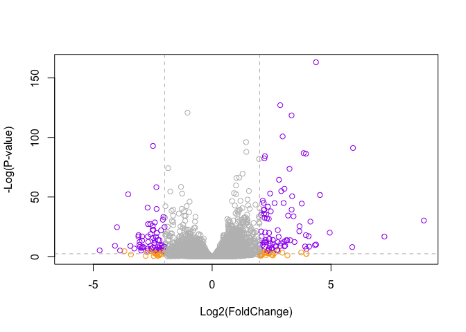

Class 12 Lab: Transcriptomics and the analysis of RNA-Seq data
================
Andres Sandoval

# Biocconductor and DESeq2 Setup

Downloading the “BiocManager” and “DESeq2” packages and loading the
libraries using the `library()` function.

``` r
library(BiocManager)
library(DESeq2)
```

# Import countData and colData

Download and read the given csv files.

``` r
counts <- read.csv("airway_scaledcounts.csv", row.names = 1)
metadata <- read.csv("airway_metadata.csv")

head(counts)
```

                    SRR1039508 SRR1039509 SRR1039512 SRR1039513 SRR1039516
    ENSG00000000003        723        486        904        445       1170
    ENSG00000000005          0          0          0          0          0
    ENSG00000000419        467        523        616        371        582
    ENSG00000000457        347        258        364        237        318
    ENSG00000000460         96         81         73         66        118
    ENSG00000000938          0          0          1          0          2
                    SRR1039517 SRR1039520 SRR1039521
    ENSG00000000003       1097        806        604
    ENSG00000000005          0          0          0
    ENSG00000000419        781        417        509
    ENSG00000000457        447        330        324
    ENSG00000000460         94        102         74
    ENSG00000000938          0          0          0

``` r
dim(counts)
```

    [1] 38694     8

``` r
nrow(counts)
```

    [1] 38694

``` r
ncol(counts)
```

    [1] 8

> Q1. How many genes are in this dataset?

38694 genes

``` r
(metadata)
```

              id     dex celltype     geo_id
    1 SRR1039508 control   N61311 GSM1275862
    2 SRR1039509 treated   N61311 GSM1275863
    3 SRR1039512 control  N052611 GSM1275866
    4 SRR1039513 treated  N052611 GSM1275867
    5 SRR1039516 control  N080611 GSM1275870
    6 SRR1039517 treated  N080611 GSM1275871
    7 SRR1039520 control  N061011 GSM1275874
    8 SRR1039521 treated  N061011 GSM1275875

Let’s make sure that the ID column of the metadata match the order of
the columns in countData.

``` r
metadata[,"id"]
```

    [1] "SRR1039508" "SRR1039509" "SRR1039512" "SRR1039513" "SRR1039516"
    [6] "SRR1039517" "SRR1039520" "SRR1039521"

``` r
# could also use metadata$id 
# now check to see if it matches the count data
# this can be accomplished using the `==` function
colnames(counts) 
```

    [1] "SRR1039508" "SRR1039509" "SRR1039512" "SRR1039513" "SRR1039516"
    [6] "SRR1039517" "SRR1039520" "SRR1039521"

``` r
metadata$id == colnames(counts)
```

    [1] TRUE TRUE TRUE TRUE TRUE TRUE TRUE TRUE

The `all()` function will check if all inputs are true. If one is false,
the function will return an output of false.

``` r
all(metadata$id == colnames(counts))
```

    [1] TRUE

> Q2. How many control cell lines do we have?

``` r
ncol(metadata)
```

    [1] 4

We have 4 control cell lines.

Let;s first extract our counts for control samples as I want to compare
this to the counts for treated (i.e with drug) samples.

``` r
control.inds <- metadata$dex == "control"
control.ids <- metadata$id[control.inds]
control.counts <- counts[,control.ids]
head(control.counts)
```

                    SRR1039508 SRR1039512 SRR1039516 SRR1039520
    ENSG00000000003        723        904       1170        806
    ENSG00000000005          0          0          0          0
    ENSG00000000419        467        616        582        417
    ENSG00000000457        347        364        318        330
    ENSG00000000460         96         73        118        102
    ENSG00000000938          0          1          2          0

``` r
#this will have all 38,694 genes with the 4 controls as columns
```

I want a single summary counts value for each gene in the control
experiments. I will start by simply taking the average.

``` r
#apply(control.counts, 1, mean)
#the above function applies the mean function across the rows
#simpler way to do this 
control.mean <- rowMeans(control.counts)
```

Now do the same for treated means.

``` r
treated.inds <- metadata$dex == "treated"
treated.ids <- metadata$id[treated.inds]
treated.counts <- counts[,treated.ids]
head(treated.counts)
```

                    SRR1039509 SRR1039513 SRR1039517 SRR1039521
    ENSG00000000003        486        445       1097        604
    ENSG00000000005          0          0          0          0
    ENSG00000000419        523        371        781        509
    ENSG00000000457        258        237        447        324
    ENSG00000000460         81         66         94         74
    ENSG00000000938          0          0          0          0

``` r
treated.mean <- rowMeans(treated.counts)
```

To help us stay organized let’s make a new data.frame to store these
results together.

``` r
meancounts <- data.frame(control.mean, treated.mean)
head(meancounts)
```

                    control.mean treated.mean
    ENSG00000000003       900.75       658.00
    ENSG00000000005         0.00         0.00
    ENSG00000000419       520.50       546.00
    ENSG00000000457       339.75       316.50
    ENSG00000000460        97.25        78.75
    ENSG00000000938         0.75         0.00

> Q3. How would you make the above code in either approach more robust?

Instead of using the functions used within the lab worksheet, you could
use the `rowMeans()` after establishing the vector of the names of the
control and treated individually.

> Q4. Follow the same procedure for the treated samples (i.e. calculate
> the mean per gene across drug treated samples and assign to a labeled
> vector called treated.mean)

Work shown above.

And now let’s make a plot to see how we are doing.

> Q5 (a). Create a scatter plot showing the mean of the treated samples
> against the mean of the control samples.

``` r
plot(meancounts$control.mean, meancounts$treated.mean)
```


> Q5 (b).You could also use the ggplot2 package to make this figure
> producing the plot below. What geom\_?() function would you use for
> this plot?

geom_point

> Q6. Try plotting both axes on a log scale. What is the argument to
> plot() that allows you to do this?

``` r
plot(meancounts$control.mean, meancounts$treated.mean, log = "xy")
```

    Warning in xy.coords(x, y, xlabel, ylabel, log): 15032 x values <= 0 omitted
    from logarithmic plot

    Warning in xy.coords(x, y, xlabel, ylabel, log): 15281 y values <= 0 omitted
    from logarithmic plot


The most useful and most straightforward to understand is log2
transform.

``` r
log2(20/20)
```

    [1] 0

``` r
# 0 indicates nothing happened
log2(40/20)
```

    [1] 1

``` r
# 1 shows that it was doubled 
log2(10/20)
```

    [1] -1

``` r
# -1 shows that it was halved
log2(80/20)
```

    [1] 2

``` r
# 2 indicates that it was doubled twice
```

Add a “log2 fold-change”

``` r
meancounts$log2fc <- log2( meancounts$treated.mean / meancounts$control.mean )
```

``` r
head(meancounts)
```

                    control.mean treated.mean      log2fc
    ENSG00000000003       900.75       658.00 -0.45303916
    ENSG00000000005         0.00         0.00         NaN
    ENSG00000000419       520.50       546.00  0.06900279
    ENSG00000000457       339.75       316.50 -0.10226805
    ENSG00000000460        97.25        78.75 -0.30441833
    ENSG00000000938         0.75         0.00        -Inf

NaN means not a number (usually 0/0). -Inf is a log of a negative number

Hmm… we need to get rid of the genes where we have no count data as
taking the log2 of these 0 counts does not tell us anything.

`rowSums(meancounts[,1:2]==0)==0` can be used to identify which genes
have 0 values in either treated.mean or control.mean columns. We want to
delete these genes from the dataframe.

``` r
to.keep <- rowSums(meancounts[,1:2]==0)==0

mycounts <- meancounts[to.keep,]
head(mycounts)
```

                    control.mean treated.mean      log2fc
    ENSG00000000003       900.75       658.00 -0.45303916
    ENSG00000000419       520.50       546.00  0.06900279
    ENSG00000000457       339.75       316.50 -0.10226805
    ENSG00000000460        97.25        78.75 -0.30441833
    ENSG00000000971      5219.00      6687.50  0.35769358
    ENSG00000001036      2327.00      1785.75 -0.38194109

``` r
nrow(mycounts)
```

    [1] 21817

> Q7. What is the purpose of the arr.ind argument in the which()
> function call above? Why would we then take the first column of the
> output and need to call the unique() function?

The `arr.ind=TRUE` argument in the `which()` function returns the row
and column of True value. It will tell us which genes have 0 values. We
need to disregard the genes with 0 values. Using the `unique()` function
will make sure a row will not be counted twice if it has 0 values in
both columns.

> Q8. Using the up.ind vector above can you determine how many up
> regulated genes we have at the greater than 2 fc level? How many genes
> are up regulated at the log2fc level of +2?

``` r
sum(mycounts$log2fc >= +2)
```

    [1] 314

> Q9. Using the down.ind vector above can you determine how many down
> regulated genes we have at the greater than 2 fc level? And how many
> are downregulated

``` r
sum(mycounts$log2fc <= (-2) )
```

    [1] 485

> Q10. Do you trust these results? Why or why not?

I do not trust these data points because we took a mean that included
replicates. We did not remove outliers and replicates in our mean
calculation.

# DESeq2 Analysis

``` r
library(DESeq2)
```

Like most bioconductor packages the DESeq wants it’s input and output in
a very specific format.

``` r
dds <- DESeqDataSetFromMatrix(countData = counts,
                       colData = metadata, 
                       design = ~ dex)
```

    converting counts to integer mode

    Warning in DESeqDataSet(se, design = design, ignoreRank): some variables in
    design formula are characters, converting to factors

The main DDSeq function is called DESeq

``` r
dds <- DESeq(dds)
```

    estimating size factors

    estimating dispersions

    gene-wise dispersion estimates

    mean-dispersion relationship

    final dispersion estimates

    fitting model and testing

``` r
res <- results(dds)
head(res)
```

    log2 fold change (MLE): dex treated vs control 
    Wald test p-value: dex treated vs control 
    DataFrame with 6 rows and 6 columns
                      baseMean log2FoldChange     lfcSE      stat    pvalue
                     <numeric>      <numeric> <numeric> <numeric> <numeric>
    ENSG00000000003 747.194195     -0.3507030  0.168246 -2.084470 0.0371175
    ENSG00000000005   0.000000             NA        NA        NA        NA
    ENSG00000000419 520.134160      0.2061078  0.101059  2.039475 0.0414026
    ENSG00000000457 322.664844      0.0245269  0.145145  0.168982 0.8658106
    ENSG00000000460  87.682625     -0.1471420  0.257007 -0.572521 0.5669691
    ENSG00000000938   0.319167     -1.7322890  3.493601 -0.495846 0.6200029
                         padj
                    <numeric>
    ENSG00000000003  0.163035
    ENSG00000000005        NA
    ENSG00000000419  0.176032
    ENSG00000000457  0.961694
    ENSG00000000460  0.815849
    ENSG00000000938        NA

padj adjust the p-value to make it representative of a large data set.
This is because 5% of 30,000 results in a lot of false positives.

# Volcano Plot

A major summary figure of this type of analysis is called a volcano
plot. The idea here is to keep our inner biologist and inner
statistician satisfied with one plot.

``` r
# a plot of log2foldchange and adjusted p-value
plot(res$log2FoldChange, res$padj)
```


Improve the plot above by taking the log of that p-value.

``` r
plot(res$log2FoldChange, log(res$padj))
```


I want to flip the y-axis so the values I care about (i.e. the low
p-value or high log(p-value) are at the top of the axis).

``` r
#the negative symbol flips the y-axis
plot(res$log2FoldChange, -log(res$padj))
```


Add some color

``` r
mycols <- rep("gray", nrow(res))
mycols[ abs(res$log2FoldChange) > 2 ]  <- "orange" 

inds <- (res$padj < 0.01) & (abs(res$log2FoldChange) > 2 )
mycols[ inds ] <- "purple"

# Volcano plot with custom colors 
plot( res$log2FoldChange,  -log(res$padj), 
 col=mycols, ylab="-Log(P-value)", xlab="Log2(FoldChange)" )

# Cut-off lines
abline(v=c(-2,2), col="gray", lty=2)
abline(h=-log(0.1), col="gray", lty=2)
```



# Gene Annotation

We will use one of Bioconductor’s main annotation packages to help with
mapping between various ID schemes. Here we load the `AnnotationDbi`
package and the annotation data package for humans `org.Hs.eg.db`.

``` r
head(res)
```

    log2 fold change (MLE): dex treated vs control 
    Wald test p-value: dex treated vs control 
    DataFrame with 6 rows and 6 columns
                      baseMean log2FoldChange     lfcSE      stat    pvalue
                     <numeric>      <numeric> <numeric> <numeric> <numeric>
    ENSG00000000003 747.194195     -0.3507030  0.168246 -2.084470 0.0371175
    ENSG00000000005   0.000000             NA        NA        NA        NA
    ENSG00000000419 520.134160      0.2061078  0.101059  2.039475 0.0414026
    ENSG00000000457 322.664844      0.0245269  0.145145  0.168982 0.8658106
    ENSG00000000460  87.682625     -0.1471420  0.257007 -0.572521 0.5669691
    ENSG00000000938   0.319167     -1.7322890  3.493601 -0.495846 0.6200029
                         padj
                    <numeric>
    ENSG00000000003  0.163035
    ENSG00000000005        NA
    ENSG00000000419  0.176032
    ENSG00000000457  0.961694
    ENSG00000000460  0.815849
    ENSG00000000938        NA

``` r
library("AnnotationDbi")
library("org.Hs.eg.db")
```

Look at what ypes of IDs I can translate between from the `org.HS.eg.db`
package with the `columns()` function.

``` r
columns(org.Hs.eg.db)
```

     [1] "ACCNUM"       "ALIAS"        "ENSEMBL"      "ENSEMBLPROT"  "ENSEMBLTRANS"
     [6] "ENTREZID"     "ENZYME"       "EVIDENCE"     "EVIDENCEALL"  "GENENAME"    
    [11] "GENETYPE"     "GO"           "GOALL"        "IPI"          "MAP"         
    [16] "OMIM"         "ONTOLOGY"     "ONTOLOGYALL"  "PATH"         "PFAM"        
    [21] "PMID"         "PROSITE"      "REFSEQ"       "SYMBOL"       "UCSCKG"      
    [26] "UNIPROT"     

use the `mapIDs()` function so that you do not have to do a Google
search of each gene in the `res` data set.

``` r
res$symbol <- mapIds(x = org.Hs.eg.db, 
                      column = "SYMBOL", # The new format we want to add
                      keys = rownames(res), # Our gene names
                      keytype = "ENSEMBL", # The format of our gene names
                     multiVals="first") 
```

    'select()' returned 1:many mapping between keys and columns

and do the same for ENTREZID and GENENAME

``` r
res$entrez <- mapIds(x = org.Hs.eg.db,
       column = "ENTREZID",
       keys = rownames(res),
       keytype = "ENSEMBL", 
       multiVals="first")
```

    'select()' returned 1:many mapping between keys and columns

``` r
res$genename <- mapIds(x = org.Hs.eg.db,
       column = "GENENAME",
       keys = rownames(res),
       keytype = "ENSEMBL", 
       multiVals="first")
```

    'select()' returned 1:many mapping between keys and columns

``` r
res$uniprot <- mapIds(x = org.Hs.eg.db,
       column = "UNIPROT",
       keys = rownames(res),
       keytype = "ENSEMBL", 
       multiVals="first")
```

    'select()' returned 1:many mapping between keys and columns

# Pathway Analysis

We will finish this lab with a quick pathway anlysis. Here we play with
just one, the GAGE package (which stands for Generally Applicable Gene
set Enrichment), to do KEGG pathway enrichment analysis on our RNA-seq
based differential expression results

``` r
library(pathview)
```

    ##############################################################################
    Pathview is an open source software package distributed under GNU General
    Public License version 3 (GPLv3). Details of GPLv3 is available at
    http://www.gnu.org/licenses/gpl-3.0.html. Particullary, users are required to
    formally cite the original Pathview paper (not just mention it) in publications
    or products. For details, do citation("pathview") within R.

    The pathview downloads and uses KEGG data. Non-academic uses may require a KEGG
    license agreement (details at http://www.kegg.jp/kegg/legal.html).
    ##############################################################################

``` r
library(gage)
```

``` r
library(gageData)

data(kegg.sets.hs)

# Examine the first 2 pathways in this kegg set for humans
head(kegg.sets.hs, 2)
```

    $`hsa00232 Caffeine metabolism`
    [1] "10"   "1544" "1548" "1549" "1553" "7498" "9"   

    $`hsa00983 Drug metabolism - other enzymes`
     [1] "10"     "1066"   "10720"  "10941"  "151531" "1548"   "1549"   "1551"  
     [9] "1553"   "1576"   "1577"   "1806"   "1807"   "1890"   "221223" "2990"  
    [17] "3251"   "3614"   "3615"   "3704"   "51733"  "54490"  "54575"  "54576" 
    [25] "54577"  "54578"  "54579"  "54600"  "54657"  "54658"  "54659"  "54963" 
    [33] "574537" "64816"  "7083"   "7084"   "7172"   "7363"   "7364"   "7365"  
    [41] "7366"   "7367"   "7371"   "7372"   "7378"   "7498"   "79799"  "83549" 
    [49] "8824"   "8833"   "9"      "978"   

The main `gage()` function requires a named vector of fold changes,
where the names of the values are the Entrez gene IDs.

``` r
foldchanges <- res$log2FoldChange
names(foldchanges) <- res$entrez

head(foldchanges)
```

           7105       64102        8813       57147       55732        2268 
    -0.35070302          NA  0.20610777  0.02452695 -0.14714205 -1.73228897 

Now I can run the `gage()` function.

``` r
# Get the results
keggres = gage(foldchanges, gsets=kegg.sets.hs)
```

Now lets look at the object returned from gage().

``` r
attributes(keggres)
```

    $names
    [1] "greater" "less"    "stats"  

If I look at the results for the top three down regulated disease.

``` r
# Look at the first three down (less) pathways
head(keggres$less, 3)
```

                                          p.geomean stat.mean        p.val
    hsa05332 Graft-versus-host disease 0.0004250461 -3.473346 0.0004250461
    hsa04940 Type I diabetes mellitus  0.0017820293 -3.002352 0.0017820293
    hsa05310 Asthma                    0.0020045888 -3.009050 0.0020045888
                                            q.val set.size         exp1
    hsa05332 Graft-versus-host disease 0.09053483       40 0.0004250461
    hsa04940 Type I diabetes mellitus  0.14232581       42 0.0017820293
    hsa05310 Asthma                    0.14232581       29 0.0020045888

Let’s pull up the highlighted pathways and show our differentiaully
expressed genes on a pathway. I will use the “hsa” KEGG id to get the
pathway from KEGG and my `foldchange` vector to show my genes.

``` r
pathview(gene.data=foldchanges, pathway.id="hsa05310")
```

    'select()' returned 1:1 mapping between keys and columns

    Info: Working in directory /Users/andressandoval/Documents/BIMM 143/bimm143_github/class12

    Info: Writing image file hsa05310.pathview.png

Put this into my document.


