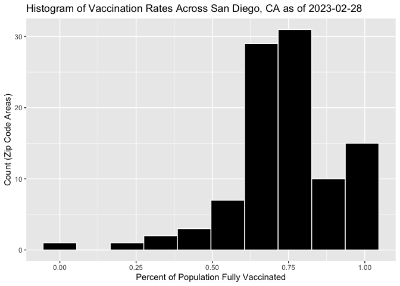
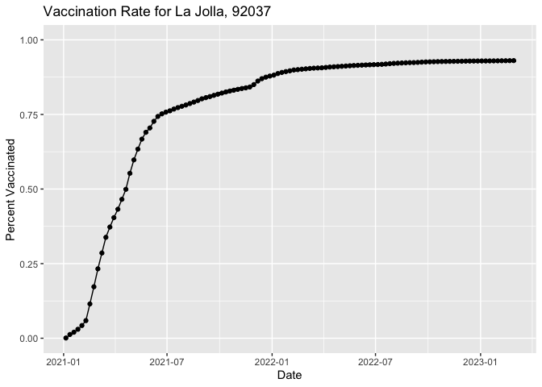
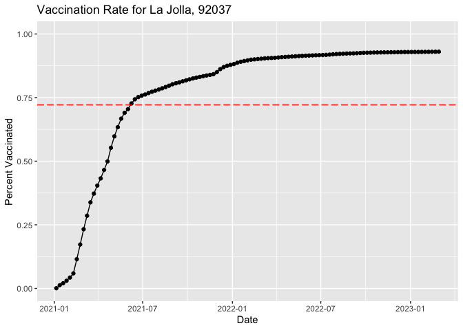
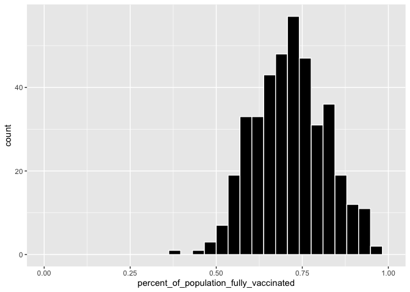
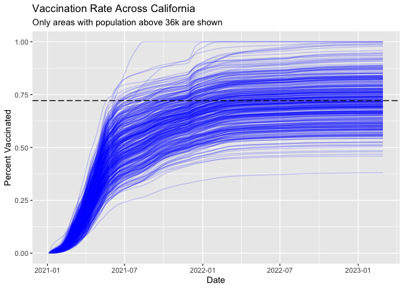

Class 17: Mini Vaccination Project
================
Andres Sandoval

# Getting Started

``` r
vax <- read.csv("covid19vaccinesbyzipcode_test.csv")
head(vax)
```

      as_of_date zip_code_tabulation_area local_health_jurisdiction    county
    1 2021-01-05                    95446                    Sonoma    Sonoma
    2 2021-01-05                    96014                  Siskiyou  Siskiyou
    3 2021-01-05                    96087                    Shasta    Shasta
    4 2021-01-05                    96008                    Shasta    Shasta
    5 2021-01-05                    95410                 Mendocino Mendocino
    6 2021-01-05                    95527                   Trinity   Trinity
      vaccine_equity_metric_quartile                 vem_source
    1                              2 Healthy Places Index Score
    2                              2    CDPH-Derived ZCTA Score
    3                              2    CDPH-Derived ZCTA Score
    4                             NA            No VEM Assigned
    5                              3    CDPH-Derived ZCTA Score
    6                              2    CDPH-Derived ZCTA Score
      age12_plus_population age5_plus_population tot_population
    1                4840.7                 5057           5168
    2                 135.0                  135            135
    3                 513.9                  544            544
    4                1125.3                 1164             NA
    5                 926.3                  988            997
    6                 476.6                  485            499
      persons_fully_vaccinated persons_partially_vaccinated
    1                       NA                           NA
    2                       NA                           NA
    3                       NA                           NA
    4                       NA                           NA
    5                       NA                           NA
    6                       NA                           NA
      percent_of_population_fully_vaccinated
    1                                     NA
    2                                     NA
    3                                     NA
    4                                     NA
    5                                     NA
    6                                     NA
      percent_of_population_partially_vaccinated
    1                                         NA
    2                                         NA
    3                                         NA
    4                                         NA
    5                                         NA
    6                                         NA
      percent_of_population_with_1_plus_dose booster_recip_count
    1                                     NA                  NA
    2                                     NA                  NA
    3                                     NA                  NA
    4                                     NA                  NA
    5                                     NA                  NA
    6                                     NA                  NA
      bivalent_dose_recip_count eligible_recipient_count
    1                        NA                        0
    2                        NA                        0
    3                        NA                        2
    4                        NA                        2
    5                        NA                        0
    6                        NA                        0
                                                                   redacted
    1 Information redacted in accordance with CA state privacy requirements
    2 Information redacted in accordance with CA state privacy requirements
    3 Information redacted in accordance with CA state privacy requirements
    4 Information redacted in accordance with CA state privacy requirements
    5 Information redacted in accordance with CA state privacy requirements
    6 Information redacted in accordance with CA state privacy requirements

> Q1. What column details the total number of people fully vaccinated?

vax\$persons_fully_vaccinated

> Q2. What column details the Zip code tabulation area?

vax\$zip_code_tabulation_area

> Q3. What is the earliest date in this dataset?

``` r
head(sort(vax$as_of_date),1)
```

    [1] "2021-01-05"

January 5th, 2021

> Q4. What is the latest date in this dataset?

``` r
head(sort(vax$as_of_date, decreasing = TRUE),1)
```

    [1] "2023-02-28"

February 28th, 2023

We can use the `skim()` function for a quick overview of the data like
this.

``` r
#Don't need to call whole library do this one function 
#Do this to complete the one function from skimr package 
skimr::skim(vax)
```

|                                                  |        |
|:-------------------------------------------------|:-------|
| Name                                             | vax    |
| Number of rows                                   | 199332 |
| Number of columns                                | 18     |
| \_\_\_\_\_\_\_\_\_\_\_\_\_\_\_\_\_\_\_\_\_\_\_   |        |
| Column type frequency:                           |        |
| character                                        | 5      |
| numeric                                          | 13     |
| \_\_\_\_\_\_\_\_\_\_\_\_\_\_\_\_\_\_\_\_\_\_\_\_ |        |
| Group variables                                  | None   |

Data summary

**Variable type: character**

| skim_variable             | n_missing | complete_rate | min | max | empty | n_unique | whitespace |
|:--------------------------|----------:|--------------:|----:|----:|------:|---------:|-----------:|
| as_of_date                |         0 |             1 |  10 |  10 |     0 |      113 |          0 |
| local_health_jurisdiction |         0 |             1 |   0 |  15 |   565 |       62 |          0 |
| county                    |         0 |             1 |   0 |  15 |   565 |       59 |          0 |
| vem_source                |         0 |             1 |  15 |  26 |     0 |        3 |          0 |
| redacted                  |         0 |             1 |   2 |  69 |     0 |        2 |          0 |

**Variable type: numeric**

| skim_variable                              | n_missing | complete_rate |     mean |       sd |    p0 |      p25 |      p50 |      p75 |     p100 | hist  |
|:-------------------------------------------|----------:|--------------:|---------:|---------:|------:|---------:|---------:|---------:|---------:|:------|
| zip_code_tabulation_area                   |         0 |          1.00 | 93665.11 |  1817.38 | 90001 | 92257.75 | 93658.50 | 95380.50 |  97635.0 | ▃▅▅▇▁ |
| vaccine_equity_metric_quartile             |      9831 |          0.95 |     2.44 |     1.11 |     1 |     1.00 |     2.00 |     3.00 |      4.0 | ▇▇▁▇▇ |
| age12_plus_population                      |         0 |          1.00 | 18895.04 | 18993.87 |     0 |  1346.95 | 13685.10 | 31756.12 |  88556.7 | ▇▃▂▁▁ |
| age5_plus_population                       |         0 |          1.00 | 20875.24 | 21105.97 |     0 |  1460.50 | 15364.00 | 34877.00 | 101902.0 | ▇▃▂▁▁ |
| tot_population                             |      9718 |          0.95 | 23372.77 | 22628.51 |    12 |  2126.00 | 18714.00 | 38168.00 | 111165.0 | ▇▅▂▁▁ |
| persons_fully_vaccinated                   |     16525 |          0.92 | 13962.33 | 15054.09 |    11 |   930.00 |  8566.00 | 23302.00 |  87566.0 | ▇▃▁▁▁ |
| persons_partially_vaccinated               |     16525 |          0.92 |  1701.64 |  2030.18 |    11 |   165.00 |  1196.00 |  2535.00 |  39913.0 | ▇▁▁▁▁ |
| percent_of_population_fully_vaccinated     |     20825 |          0.90 |     0.57 |     0.25 |     0 |     0.42 |     0.60 |     0.74 |      1.0 | ▂▃▆▇▃ |
| percent_of_population_partially_vaccinated |     20825 |          0.90 |     0.08 |     0.09 |     0 |     0.05 |     0.06 |     0.08 |      1.0 | ▇▁▁▁▁ |
| percent_of_population_with_1\_plus_dose    |     21859 |          0.89 |     0.63 |     0.24 |     0 |     0.49 |     0.67 |     0.81 |      1.0 | ▂▂▅▇▆ |
| booster_recip_count                        |     72872 |          0.63 |  5837.31 |  7165.81 |    11 |   297.00 |  2748.00 |  9438.25 |  59553.0 | ▇▂▁▁▁ |
| bivalent_dose_recip_count                  |    158664 |          0.20 |  2924.93 |  3583.45 |    11 |   190.00 |  1418.00 |  4626.25 |  27458.0 | ▇▂▁▁▁ |
| eligible_recipient_count                   |         0 |          1.00 | 12801.84 | 14908.33 |     0 |   504.00 |  6338.00 | 21973.00 |  87234.0 | ▇▃▁▁▁ |

> Q5. How many numeric columns are in this dataset?

13

> Q6. Note that there are “missing values” in the dataset. How many NA
> values there in the persons_fully_vaccinated column?

``` r
n.missing <- sum(is.na(vax$persons_fully_vaccinated))
```

> Q7. What percent of persons_fully_vaccinated values are missing (to 2
> significant figures)?

``` r
round(sum(is.na(vax$persons_fully_vaccinated)) / length(vax$persons_fully_vaccinated) *100, 2)
```

    [1] 8.29

``` r
# or...
#round(n.missing / nrow(vax) *100, 2)
```

> Q8. \[Optional\]: Why might this data be missing?

Some areas do not report their data, such as military bases. Military
bases don’t report their values to the database and therefore they are
missing, even if the military is indeed highly mandated for vaccination.

# Working with dates

First install and load the “lubridate” package. The lubridate package
makes working with dates and times in R much less of a pain. Let’s have
a first play with this package here.

``` r
library(lubridate)
```


    Attaching package: 'lubridate'

    The following objects are masked from 'package:base':

        date, intersect, setdiff, union

``` r
today()
```

    [1] "2023-03-16"

``` r
# This will give an Error!
#today() - vax$as_of_date[1]
```

This gives an error because the dates within the vax data frame are not
read as dates, but a character string. WE need to specify that we are
using the year-month-day format.

``` r
# Specify that we are using the year-month-day format
vax$as_of_date <- ymd(vax$as_of_date)
```

We can now magically do math with the dates.

> Q. How old am I in dates?

``` r
today() - ymd("2001-03-29")
```

    Time difference of 8022 days

> How many days have passed since the first vaccination reported in this
> dataset?

``` r
today() - vax$as_of_date[1]
```

    Time difference of 800 days

> Using the last and the first date value we can now determine how many
> days the dataset span?

``` r
vax$as_of_date[nrow(vax)] - vax$as_of_date[1]
```

    Time difference of 784 days

> Q9. How many days have passed since the last update of the dataset?

``` r
today() - vax$as_of_date[nrow(vax)]
```

    Time difference of 16 days

> Q10. How many unique dates are in the dataset (i.e. how many different
> dates are detailed)?

``` r
dplyr :: n_distinct(vax$as_of_date)
```

    [1] 113

``` r
# or...
#length(unique(vax$as_of_date))
```

As of today there are a 113 different dates in this data set.

# Working with ZIP codes

One of the numeric columns in the data set (namely
vax\$zip_code_tabulation_area) are actually ZIP codes - a postal code
used by the United States Postal Service (USPS). In R we can use the
`zipcodeR` package to make working with these codes easier.

``` r
library(zipcodeR)
```

``` r
geocode_zip( '96706')
```

    # A tibble: 1 × 3
      zipcode   lat   lng
      <chr>   <dbl> <dbl>
    1 96706    21.3 -158.

Calculate the distance between the centroids of any two ZIP codes in
miles

``` r
zip_distance('85379','92109')
```

      zipcode_a zipcode_b distance
    1     85379     92109   286.89

More usefully, we can pull census data about ZIP code areas (including
median household income etc.)

``` r
reverse_zipcode(c('92122', '85379', '96706', '94112') )
```

    # A tibble: 4 × 24
      zipcode zipcode_…¹ major…² post_…³ common_c…⁴ county state   lat   lng timez…⁵
      <chr>   <chr>      <chr>   <chr>       <blob> <chr>  <chr> <dbl> <dbl> <chr>  
    1 85379   Standard   Surpri… Surpri… <raw 30 B> Maric… AZ     33.6 -112. Americ…
    2 92122   Standard   San Di… San Di… <raw 21 B> San D… CA     32.9 -117. Pacific
    3 94112   Standard   San Fr… San Fr… <raw 25 B> San F… CA     37.7 -122. Pacific
    4 96706   Standard   Ewa Be… Ewa Be… <raw 21 B> Honol… HI     21.3 -158. Pacifi…
    # … with 14 more variables: radius_in_miles <dbl>, area_code_list <blob>,
    #   population <int>, population_density <dbl>, land_area_in_sqmi <dbl>,
    #   water_area_in_sqmi <dbl>, housing_units <int>,
    #   occupied_housing_units <int>, median_home_value <int>,
    #   median_household_income <int>, bounds_west <dbl>, bounds_east <dbl>,
    #   bounds_north <dbl>, bounds_south <dbl>, and abbreviated variable names
    #   ¹​zipcode_type, ²​major_city, ³​post_office_city, ⁴​common_city_list, …

We can use this reverse_zipcode() to pull census data later on for any
or all ZIP code areas we might be interested in.

``` r
# Pull data for all ZIP codes in the dataset
#zipdata <- reverse_zipcode( vax$zip_code_tabulation_area )
```

# Focus on the San Diego area

Let’s now focus in on the San Diego County area by restricting ourselves
first to vax\$county == “San Diego” entries. We have two main choices on
how to do this. The first using base R the second using the dplyr
package:

``` r
library(dplyr)
```


    Attaching package: 'dplyr'

    The following objects are masked from 'package:stats':

        filter, lag

    The following objects are masked from 'package:base':

        intersect, setdiff, setequal, union

``` r
# Subset to San Diego county only areas
sd <- vax[ vax$county == "San Diego" , ]
```

``` r
sd <- filter(vax, county == "San Diego")

nrow(sd)
```

    [1] 12091

Using dplyr is often more convenient when we are subsetting across
multiple criteria - for example all San Diego county areas with a
population of over 10,000.

``` r
sd.10 <-filter(vax, county == "San Diego" & age5_plus_population > 10000)
```

> Q11. How many distinct zip codes are listed for San Diego County?

``` r
n_distinct(sd$zip_code_tabulation_area)
```

    [1] 107

``` r
#length(unique(sd$zip_code_tabulation_area))
```

There are 107 different zipcodes in San Diego.

> Q12. What San Diego County Zip code area has the largest 12 +
> Population in this dataset?

``` r
# this will spit out the row of the max age 12 population
#which.max(sd$age12_plus_population)
# now use the row number to find the zip code
sd$zip_code_tabulation_area[which.max(sd$age12_plus_population)]
```

    [1] 92154

Zip Code 92154 has the largest 12+ population.

> Q13. What is the overall average “Percent of Population Fully
> Vaccinated” value for all San Diego “County” as of “2023-02-28”?

``` r
x <- filter(sd, as_of_date >= "2023-02-28")
```

``` r
round(mean(x$percent_of_population_fully_vaccinated, na.rm = TRUE) *100, 2)
```

    [1] 74.01

The overall percent is 74.01%

> Q14. Using either ggplot or base R graphics make a summary figure that
> shows the distribution of Percent of Population Fully Vaccinated
> values as of “2023-02-28”?

``` r
library(ggplot2)

ggplot(x,  aes(percent_of_population_fully_vaccinated)) + geom_histogram(color= "White", fill = "black", na.rm= TRUE, bins = 10) + ggtitle("Histogram of Vaccination Rates Across San Diego, CA as of 2023-02-28") + xlab("Percent of Population Fully Vaccinated") + ylab("Count (Zip Code Areas)")
```



# Focus on UCSD/La Jolla

UC San Diego resides in the 92037 ZIP code area and is listed with an
age 5+ population size of 36,144.

``` r
ucsd <- filter(sd, zip_code_tabulation_area=="92037")
ucsd[1,]$age5_plus_population
```

    [1] 36144

> Q15. Using ggplot make a graph of the vaccination rate time course for
> the 92037 ZIP code area:

``` r
ggplot(ucsd) +
  aes(as_of_date, percent_of_population_fully_vaccinated) +
  geom_point() +
  geom_line(group=1) +
  ylim(c(0,1)) +
  labs(title= "Vaccination Rate for La Jolla, 92037" , x= "Date", y="Percent Vaccinated")
```



# Comparing to similar sized areas

Let’s return to the full dataset and look across every zip code area
with a population at least as large as that of 92037 on as_of_date
“2023-02-28”.

``` r
# Subset to all CA areas with a population as large as 92037
vax.36 <- filter(vax, age5_plus_population > 36144 &
                as_of_date == "2023-02-28")

head(vax.36)
```

      as_of_date zip_code_tabulation_area local_health_jurisdiction      county
    1 2023-02-28                    93257                    Tulare      Tulare
    2 2023-02-28                    93535               Los Angeles Los Angeles
    3 2023-02-28                    91367               Los Angeles Los Angeles
    4 2023-02-28                    90025               Los Angeles Los Angeles
    5 2023-02-28                    90024               Los Angeles Los Angeles
    6 2023-02-28                    90031               Los Angeles Los Angeles
      vaccine_equity_metric_quartile                 vem_source
    1                              1 Healthy Places Index Score
    2                              1 Healthy Places Index Score
    3                              3 Healthy Places Index Score
    4                              4 Healthy Places Index Score
    5                              3 Healthy Places Index Score
    6                              1 Healthy Places Index Score
      age12_plus_population age5_plus_population tot_population
    1               61519.8                70784          76519
    2               59042.7                68471          74264
    3               40437.4                43398          45970
    4               42803.2                44982          46883
    5               48841.8                50198          51627
    6               34503.3                37735          39916
      persons_fully_vaccinated persons_partially_vaccinated
    1                    45104                         5629
    2                    45338                         4907
    3                    33648                         2948
    4                    36156                         4530
    5                    28005                         5788
    6                    29270                         3186
      percent_of_population_fully_vaccinated
    1                               0.589448
    2                               0.610498
    3                               0.731956
    4                               0.771196
    5                               0.542449
    6                               0.733290
      percent_of_population_partially_vaccinated
    1                                   0.073563
    2                                   0.066075
    3                                   0.064129
    4                                   0.096624
    5                                   0.112112
    6                                   0.079818
      percent_of_population_with_1_plus_dose booster_recip_count
    1                               0.663011               22106
    2                               0.676573               21799
    3                               0.796085               22052
    4                               0.867820               25207
    5                               0.654561               19239
    6                               0.813108               17344
      bivalent_dose_recip_count eligible_recipient_count redacted
    1                      4981                    45046       No
    2                      6754                    45247       No
    3                      9234                    33544       No
    4                     12099                    35980       No
    5                      8578                    27934       No
    6                      6076                    29213       No

> Q16. Calculate the mean “Percent of Population Fully Vaccinated” for
> ZIP code areas with a population as large as 92037 (La Jolla)
> as_of_date “2023-02-28”. Add this as a straight horizontal line to
> your plot from above with the geom_hline() function?

``` r
y <- mean(vax.36$percent_of_population_fully_vaccinated)
y
```

    [1] 0.7213331

``` r
ggplot(ucsd) +
  aes(as_of_date, percent_of_population_fully_vaccinated) +
  geom_point() +
  geom_line(group=1) +
  ylim(c(0,1)) +
  labs(title= "Vaccination Rate for La Jolla, 92037" , x= "Date", y="Percent Vaccinated") + geom_hline(yintercept=y, col= "red", linetype = 11)
```



> Q17. What is the 6 number summary (Min, 1st Qu., Median, Mean, 3rd
> Qu., and Max) of the “Percent of Population Fully Vaccinated” values
> for ZIP code areas with a population as large as 92037 (La Jolla)
> as_of_date “2023-02-28”?

``` r
summary(vax.36$percent_of_population_fully_vaccinated)
```

       Min. 1st Qu.  Median    Mean 3rd Qu.    Max. 
     0.3804  0.6457  0.7181  0.7213  0.7907  1.0000 

> Q18. Using ggplot generate a histogram of this data.

``` r
ggplot(vax.36) +aes(percent_of_population_fully_vaccinated) +geom_histogram(col= "white", fill = "Black", na.rm = TRUE) + xlim(0,1) 
```

    `stat_bin()` using `bins = 30`. Pick better value with `binwidth`.



> Q19. Is the 92109 and 92040 ZIP code areas above or below the average
> value you calculated for all these above?

``` r
z <- filter(vax.36, zip_code_tabulation_area %in% c("92109", "92040"))
z$percent_of_population_fully_vaccinated
```

    [1] 0.694572 0.550296

``` r
#or...
#y >= vax %>% filter(as_of_date == "2023-02-28") %>% 
#filter(zip_code_tabulation_area=="92040") %>% 
#select(percent_of_population_fully_vaccinated)
```

The values are below the average.

> Q20. Finally make a time course plot of vaccination progress for all
> areas in the full dataset with a age5_plus_population \> 36144.

``` r
vax.36.all <- filter(vax, age5_plus_population > 36144)


ggplot(vax.36.all) +
  aes(as_of_date,
      percent_of_population_fully_vaccinated, 
      group=zip_code_tabulation_area) +
  geom_line(alpha=0.2, color="Blue", na.rm = TRUE) +
  ylim(0,1) +
  labs(x="Date", y="Percent Vaccinated",
       title="Vaccination Rate Across California",
       subtitle="Only areas with population above 36k are shown") +
  geom_hline(yintercept = y, linetype= 11)
```



> Q21. How do you feel about traveling for Thanksgiving Break and
> meeting for in-person class afterwards?

Feelin Good.
