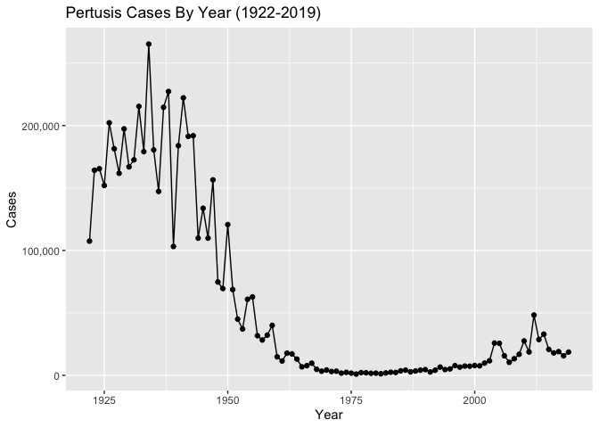
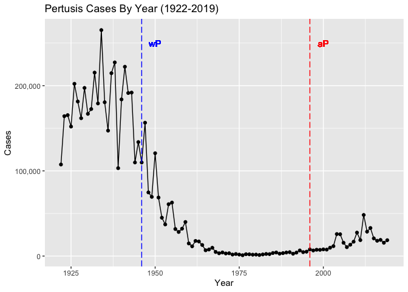
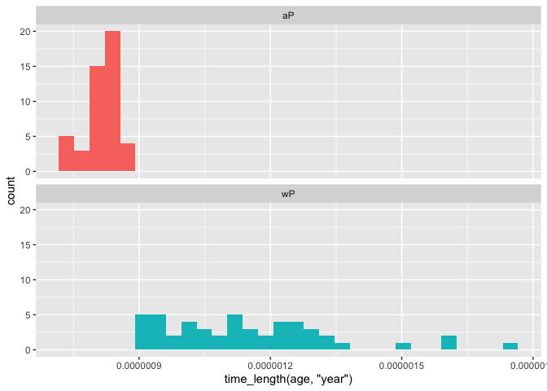
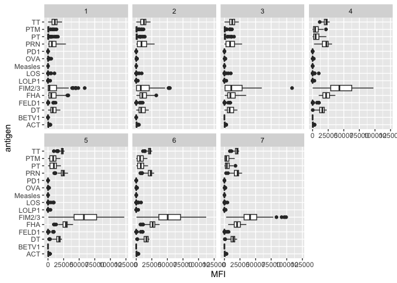
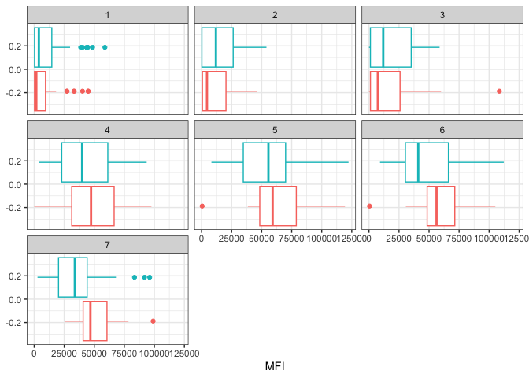
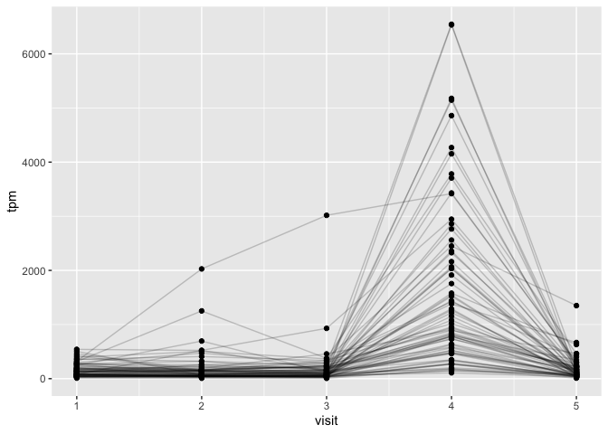
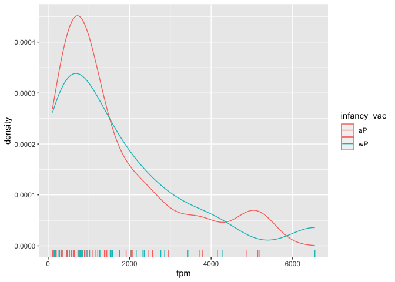

Class 19: Investigating Pertussis Resurgence
================
Andres Sandoval

# 1. Investigating pertussis cases by year

The CDC tracks the cases of Pertussis in the US. We can get their data
via web-scrapping.

> Q1. With the help of the R “addin” package datapasta assign the CDC
> pertussis case number data to a data frame called cdc and use ggplot
> to make a plot of cases numbers over time.

First install the “datapasta” package and then using the addins tab at
the top. “Paste as data frame.”

Here the cdc data frame was created but the code chunk is hidden using
echo=FALSE in the {r} section

``` r
options(scipen = 999)
library(ggplot2)

baseplot <- ggplot(cdc) +
  aes(Year, Cases) +
  geom_point() +
  geom_line() + scale_y_continuous(labels = scales::comma) +
  labs(title ="Pertusis Cases By Year (1922-2019)", xlab = "Year", ylab = "Cases")
baseplot
```



# 2. A tale of two vaccines (wP & aP)

Two types of pertussis vaccines are currently available: whole-cell
pertussis (wP) and acellular pertussis (aP).The first vaccines were
composed of ‘whole cell’ (wP) inactivated bacteria, while aP vaccines
use purified antigens of the bacteria. These aP vaccines were developed
to have less side effects than the older wP vaccines and are now the
only form administered in the United States. Let’s return to our CDC
data plot and examine what happened after the switch to the acellular
pertussis (aP) vaccination program.

> Q2. Using the ggplot geom_vline() function add lines to your previous
> plot for the 1946 introduction of the wP vaccine and the 1996 switch
> to aP vaccine (see example in the hint below). What do you notice?

``` r
baseplot + geom_vline(xintercept = 1946, col= "blue", linetype=5) + geom_text(aes(x=1950, label="wP", y=250000), colour="blue") + geom_vline(xintercept = 1996, col= "red", linetype=5) + geom_text(aes(x=2000, label="aP", y=250000), colour="red")
```



> Q3. Describe what happened after the introduction of the aP vaccine?
> Do you have a possible explanation for the observed trend?

The number of cases after the aP vaccine was stagnant at first, but
began to rise after a little while to a level that was not seen prior to
the introduction of the first wP vaccine. This could be due to the
hesitancy of vaccination. This could also be due to some new form of
Pertussis that had evolved over time.

# 3. Exploring CMI-PB data

The CMI-PB project is collecting data on aP and wP individuals and their
immune reponse to infection and or booster shots.

The CMI-PB API returns JSON data. The CMI-PB API (like most APIs) sends
responses in JSON format. Briefly, JSON data is formatted as a series of
key-value pairs, where a particular word (“key”) is associated with a
particular value.

We will use the jsonlite package to get data from this API.

``` r
library(jsonlite)
```

``` r
subject <- read_json("http://cmi-pb.org/api/subject", simplifyVector = TRUE)
head (subject)
```

      subject_id infancy_vac biological_sex              ethnicity  race
    1          1          wP         Female Not Hispanic or Latino White
    2          2          wP         Female Not Hispanic or Latino White
    3          3          wP         Female                Unknown White
    4          4          wP           Male Not Hispanic or Latino Asian
    5          5          wP           Male Not Hispanic or Latino Asian
    6          6          wP         Female Not Hispanic or Latino White
      year_of_birth date_of_boost      dataset
    1    1986-01-01    2016-09-12 2020_dataset
    2    1968-01-01    2019-01-28 2020_dataset
    3    1983-01-01    2016-10-10 2020_dataset
    4    1988-01-01    2016-08-29 2020_dataset
    5    1991-01-01    2016-08-29 2020_dataset
    6    1988-01-01    2016-10-10 2020_dataset

> Q4. How may aP and wP infancy vaccinated subjects are in the dataset?

``` r
table(subject$infancy_vac)
```


    aP wP 
    47 49 

> Q5. How many Male and Female subjects/patients are in the dataset?

``` r
table(subject$biological_sex)
```


    Female   Male 
        66     30 

> Q6. What is the breakdown of race and biological sex (e.g. number of
> Asian females, White males etc…)?

``` r
table(subject$race, subject$biological_sex)
```

                                               
                                                Female Male
      American Indian/Alaska Native                  0    1
      Asian                                         18    9
      Black or African American                      2    0
      More Than One Race                             8    2
      Native Hawaiian or Other Pacific Islander      1    1
      Unknown or Not Reported                       10    4
      White                                         27   13

## Side-Note: Working with dates

Use lubridate package

``` r
library(lubridate)
```


    Attaching package: 'lubridate'

    The following objects are masked from 'package:base':

        date, intersect, setdiff, union

First find the age of all individuals:

``` r
age_days <- today() - ymd(subject$year_of_birth)
age_years <- time_length(age_days, "years")
subject$age <- age_years
```

Now calculate the average age of all individuals:

``` r
mean(subject$age)
```

    [1] 31.05627

> Q7. Using this approach determine (i) the average age of wP
> individuals, (ii) the average age of aP individuals; and (iii) are
> they significantly different?

Now use dplyr to subset to wP or aP subjects

``` r
library(dplyr)
```


    Attaching package: 'dplyr'

    The following objects are masked from 'package:stats':

        filter, lag

    The following objects are masked from 'package:base':

        intersect, setdiff, setequal, union

``` r
wp.age <- filter(subject, subject$infancy_vac == "wP")$age
ap.age <- filter(subject, subject$infancy_vac == "aP")$age

mean(wp.age)
```

    [1] 36.36553

``` r
mean(ap.age)
```

    [1] 25.52108

T-test to test for significant difference.

``` r
t.test(wp.age, ap.age)
```


        Welch Two Sample t-test

    data:  wp.age and ap.age
    t = 12.092, df = 51.082, p-value < 0.00000000000000022
    alternative hypothesis: true difference in means is not equal to 0
    95 percent confidence interval:
      9.044045 12.644857
    sample estimates:
    mean of x mean of y 
     36.36553  25.52108 

T-test determines that these values are significantly different.

> Q8. Determine the age of all individuals at time of boost?

``` r
int <- ymd(subject$date_of_boost) - ymd(subject$year_of_birth)
age_at_boost <- time_length(int, "year")
head(age_at_boost)
```

    [1] 30.69678 51.07461 33.77413 28.65982 25.65914 28.77481

> Q9. With the help of a faceted boxplot (see below), do you think these
> two groups are significantly different?

``` r
ggplot(subject) +
  aes(time_length(age, "year"),
      fill=as.factor(infancy_vac)) +
  geom_histogram(show.legend=FALSE) +
  facet_wrap(vars(infancy_vac), nrow=2) 
```

    `stat_bin()` using `bins = 30`. Pick better value with `binwidth`.



``` r
x <- t.test(time_length( wp.age, "years" ),
       time_length( ap.age, "years" ))

x$p.value
```

    [1] 0.0000000000000001316045

These values are statistically significantly different.

## Joining multiple tables

Read the specimen and ab_titer tables into R and store the data as
specimen and titer named data frames.

``` r
specimen <- read_json("http://cmi-pb.org/api/specimen", simplifyVector = TRUE) 
titer <- read_json("http://cmi-pb.org/api/ab_titer", simplifyVector = TRUE)

head(specimen , 3)
```

      specimen_id subject_id actual_day_relative_to_boost
    1           1          1                           -3
    2           2          1                          736
    3           3          1                            1
      planned_day_relative_to_boost specimen_type visit
    1                             0         Blood     1
    2                           736         Blood    10
    3                             1         Blood     2

``` r
head(titer , 3)
```

      specimen_id isotype is_antigen_specific antigen        MFI MFI_normalised
    1           1     IgE               FALSE   Total 1110.21154       2.493425
    2           1     IgE               FALSE   Total 2708.91616       2.493425
    3           1     IgG                TRUE      PT   68.56614       3.736992
       unit lower_limit_of_detection
    1 UG/ML                 2.096133
    2 IU/ML                29.170000
    3 IU/ML                 0.530000

> Q9. Complete the code to join specimen and subject tables to make a
> new merged data frame containing all specimen records along with their
> associated subject details:

``` r
meta <- inner_join(specimen, subject)
```

    Joining with `by = join_by(subject_id)`

``` r
dim(meta)
```

    [1] 729  14

``` r
head(meta)
```

      specimen_id subject_id actual_day_relative_to_boost
    1           1          1                           -3
    2           2          1                          736
    3           3          1                            1
    4           4          1                            3
    5           5          1                            7
    6           6          1                           11
      planned_day_relative_to_boost specimen_type visit infancy_vac biological_sex
    1                             0         Blood     1          wP         Female
    2                           736         Blood    10          wP         Female
    3                             1         Blood     2          wP         Female
    4                             3         Blood     3          wP         Female
    5                             7         Blood     4          wP         Female
    6                            14         Blood     5          wP         Female
                   ethnicity  race year_of_birth date_of_boost      dataset
    1 Not Hispanic or Latino White    1986-01-01    2016-09-12 2020_dataset
    2 Not Hispanic or Latino White    1986-01-01    2016-09-12 2020_dataset
    3 Not Hispanic or Latino White    1986-01-01    2016-09-12 2020_dataset
    4 Not Hispanic or Latino White    1986-01-01    2016-09-12 2020_dataset
    5 Not Hispanic or Latino White    1986-01-01    2016-09-12 2020_dataset
    6 Not Hispanic or Latino White    1986-01-01    2016-09-12 2020_dataset
           age
    1 37.20192
    2 37.20192
    3 37.20192
    4 37.20192
    5 37.20192
    6 37.20192

> Q10. Now using the same procedure join meta with titer data so we can
> further analyze this data in terms of time of visit aP/wP, male/female
> etc.

``` r
abdata <- inner_join(titer, meta)
```

    Joining with `by = join_by(specimen_id)`

``` r
dim(abdata)
```

    [1] 32675    21

> Q11. How many specimens (i.e. entries in abdata) do we have for each
> isotype?

``` r
table(abdata$isotype)
```


     IgE  IgG IgG1 IgG2 IgG3 IgG4 
    6698 1413 6141 6141 6141 6141 

> Q12. What do you notice about the number of visit 8 specimens compared
> to other visits?

``` r
table(abdata$visit)
```


       1    2    3    4    5    6    7    8 
    5795 4640 4640 4640 4640 4320 3920   80 

There is a much lower number of visit 8 specimens compared to the
others. This is because visit 8 is still ongoing.

# 4. Examine IgG1 Ab titer levels

Now using our joined/merged/linked abdata dataset filter() for IgG1
isotype and exclude the small number of visit 8 entries, since the study
for visit 8 is still ongoing.

``` r
ig1 <- abdata %>% filter(isotype == "IgG1", visit!=8)
head(ig1)
```

      specimen_id isotype is_antigen_specific antigen        MFI MFI_normalised
    1           1    IgG1                TRUE     ACT 274.355068      0.6928058
    2           1    IgG1                TRUE     LOS  10.974026      2.1645083
    3           1    IgG1                TRUE   FELD1   1.448796      0.8080941
    4           1    IgG1                TRUE   BETV1   0.100000      1.0000000
    5           1    IgG1                TRUE   LOLP1   0.100000      1.0000000
    6           1    IgG1                TRUE Measles  36.277417      1.6638332
       unit lower_limit_of_detection subject_id actual_day_relative_to_boost
    1 IU/ML                 3.848750          1                           -3
    2 IU/ML                 4.357917          1                           -3
    3 IU/ML                 2.699944          1                           -3
    4 IU/ML                 1.734784          1                           -3
    5 IU/ML                 2.550606          1                           -3
    6 IU/ML                 4.438966          1                           -3
      planned_day_relative_to_boost specimen_type visit infancy_vac biological_sex
    1                             0         Blood     1          wP         Female
    2                             0         Blood     1          wP         Female
    3                             0         Blood     1          wP         Female
    4                             0         Blood     1          wP         Female
    5                             0         Blood     1          wP         Female
    6                             0         Blood     1          wP         Female
                   ethnicity  race year_of_birth date_of_boost      dataset
    1 Not Hispanic or Latino White    1986-01-01    2016-09-12 2020_dataset
    2 Not Hispanic or Latino White    1986-01-01    2016-09-12 2020_dataset
    3 Not Hispanic or Latino White    1986-01-01    2016-09-12 2020_dataset
    4 Not Hispanic or Latino White    1986-01-01    2016-09-12 2020_dataset
    5 Not Hispanic or Latino White    1986-01-01    2016-09-12 2020_dataset
    6 Not Hispanic or Latino White    1986-01-01    2016-09-12 2020_dataset
           age
    1 37.20192
    2 37.20192
    3 37.20192
    4 37.20192
    5 37.20192
    6 37.20192

> Q13. Complete the following code to make a summary boxplot of Ab titer
> levels for all antigens:

``` r
ggplot(ig1) +
  aes(MFI, antigen) +
  geom_boxplot() + 
  facet_wrap(vars(visit), nrow=2)
```



> Q14. What antigens show differences in the level of IgG1 antibody
> titers recognizing them over time? Why these and not others?

FIM 2/3 is one of the major components that the vaccine is recongizing.
This is why it has higher level of IgG1 antibody titiers. FHA, or
Filamentous hemagglutinin, is another one. This could be due to its role
in host cell binding and infection. DT, or Diptheria Toxin, is toxic to
Diptheria.

``` r
ggplot(ig1) +
  aes(MFI, antigen, col=infancy_vac ) +
  geom_boxplot(show.legend = FALSE) + 
  facet_wrap(vars(visit), nrow=2) +
  theme_bw()
```


``` r
ggplot(ig1) +
  aes(MFI, antigen, col=infancy_vac ) +
  geom_boxplot(show.legend = FALSE) + 
  facet_wrap(vars(infancy_vac, visit), nrow=2)
```


> Q15. Filter to pull out only two specific antigens for analysis and
> create a boxplot for each. You can chose any you like. Below I picked
> a “control” antigen (“Measles”, that is not in our vaccines) and a
> clear antigen of interest (“FIM2/3”, extra-cellular fimbriae proteins
> from B. pertussis that participate in substrate attachment).

``` r
filter(ig1, antigen=="Measles") %>%
  ggplot() +
  aes(MFI, col=infancy_vac) +
  geom_boxplot(show.legend = FALSE) +
  facet_wrap(vars(visit)) +
  theme_bw()
```


``` r
filter(ig1, antigen=="FIM2/3") %>%
  ggplot() +
  aes(MFI, col=infancy_vac) +
  geom_boxplot(show.legend = FALSE) +
  facet_wrap(vars(visit)) +
  theme_bw()
```



> Q16. What do you notice about these two antigens time course and the
> FIM2/3 data in particular?

The Measles antigen has fairly stagnant levels over time while the FIM
2/3 has MFI levels that rise over time and peak at around visit 5. and
begin to decline. These trends were similar for both wP and aP subjects.

> Q17. Do you see any clear difference in aP vs. wP responses?

The only clear differences in aP and wP responses were in the Antigen
FIM 2/3 as aP had slighlty higher levels of MFI starting at visit 4, and
proceeding to visit 7.

# 5. Obtaining CMI-PB RNASeq data

For RNA-Seq data the API query mechanism quickly hits the web browser
interface limit for file size. We will present alternative download
mechanisms for larger CMI-PB datasets in the next section. However, we
can still do “targeted” RNA-Seq querys via the web accessible API.

Let’s read available RNA-Seq data for this gene into R and investigate
the time course of it’s gene expression values.

``` r
url <- "https://www.cmi-pb.org/api/v2/rnaseq?versioned_ensembl_gene_id=eq.ENSG00000211896.7"

rna <- read_json(url, simplifyVector = TRUE) 
```

To facilitate further analysis we need to “join” the rna expression data
with our metadata meta, which is itself a join of sample and specimen
data. This will allow us to look at this genes TPM expression values
over aP/wP status and at different visits (i.e. times):

``` r
ssrna <- inner_join(rna, meta)
```

    Joining with `by = join_by(specimen_id)`

> Q18. Make a plot of the time course of gene expression for IGHG1 gene
> (i.e. a plot of visit vs. tpm).

``` r
ggplot(ssrna) +
  aes(visit, tpm, group=subject_id) +
  geom_point() +
  geom_line(alpha=0.2)
```



> Q19.: What do you notice about the expression of this gene (i.e. when
> is it at it’s maximum level)?

The expression of this gene is at its maximum level at visit 4.

> Q20. Does this pattern in time match the trend of antibody titer data?
> If not, why not?

This pattern somewhat matches up with the trend of antibody titer data.
In this graph, the maximum expression was at visit 4, while in the
antibody titer data, the maximum expression was at visit 5. The data is
different because cells make antibodies which have long lifespans. The
gene is expressed and antibodies are made. Therefore the expression of
the gene in visit 4, can carry on the same antibodies into visit 5, as
depicted by the titer data.

We can dig deeper and color and/or facet by infancy_vac status:

``` r
ggplot(ssrna) +
  aes(tpm, col=infancy_vac) +
  geom_boxplot() +
  facet_wrap(vars(visit))
```


There is no obvious wP vs. aP differences here even if we focus in on a
particular visit:

``` r
ssrna %>%  
  filter(visit==4) %>% 
  ggplot() +
    aes(tpm, col=infancy_vac) + geom_density() + 
    geom_rug() 
```


